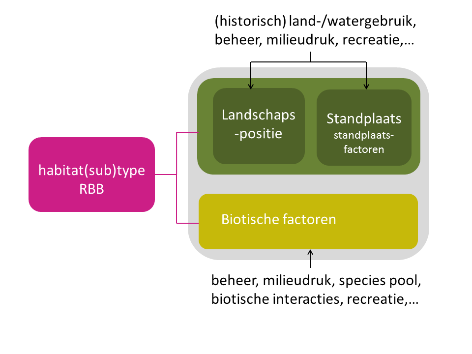

```{r setup, message=FALSE, echo=FALSE, warning=FALSE}
options(stringsAsFactors = FALSE)
library(knitr)
library(ggplot2)
uitvoer <- knitr::opts_knit$get("rmarkdown.pandoc.to")
opts_chunk$set(
  echo = ifelse(is.null(uitvoer), TRUE,
                !(uitvoer %in% c("latex", "docx"))),
  dpi = 300
)
ditbestand <- "concepten_details.Rmd"
outputdir <- "../../../docs/site/files/030_concepten"
dir.create(outputdir, recursive = TRUE)
outputdir2 <- "../../../../docs/site/files/030_concepten"
    # outputdir2: omdat bookdown zich blijkbaar anders gedraagt wanneer 'site'
    # voorkomt in een pad
```


```{r functies_om_te_compileren, eval=FALSE, echo=FALSE}
# Functie om dit document op de juiste plaats te renderen naar html (geen latex nodig):
bookdown::render_book(input = ditbestand, 
                      output_format = "bookdown::html_document2"); unlink(
                          "../../../docs/docs", recursive = TRUE) # workaround voor bookdown-
                                                                  # behaviour met 'site' in een pad

# Functie om dit document op de juiste plaats te renderen naar docx (geen latex nodig). Opgelet, gebruikt een standaard layout zonder hoofdstuknummering e.d. Ook figuurnummering is niet ondersteund.
bookdown::render_book(input = ditbestand, 
                      output_format = "bookdown::word_document2", 
                      output_dir = outputdir2); unlink(
                          "../../../docs/docs", recursive = TRUE); unlink(
                          "../../../../docs", recursive = TRUE) # workaround voor bookdown-
                                                                  # behaviour met 'site' in een pad

# Functie om dit document te renderen naar pdf (latex-installatie nodig):
bookdown::render_book(input = ditbestand, 
                      output_format = "bookdown::pdf_document2", 
                      output_dir = outputdir2); unlink(
                          "../../../docs/docs", recursive = TRUE); unlink(
                          "../../../../docs", recursive = TRUE) # workaround voor bookdown-
                                                                  # behaviour met 'site' in een pad
```

[^habitatrichtlijn]: *Richtlijn 92/43/EEG van de Raad van de Europese Gemeenschappen van 21 mei 1992 inzake de instandhouding van de natuurlijke habitats en de wilde flora en fauna.*

[^vogelrichtlijn]: *Richtlijn 79/409/EEG van de Raad van de Europese Gemeenschappen van 2 april 1979 inzake het behoud van de vogelstand.*

[^uitvoeringsbesluitEC]: *Uitvoeringsbesluit van de Europese Commissie van 11 juli 2011 betreffende een gebiedsinformatieformulier voor Natura 2000-gebieden.*

[^natuurdecreet]: *Decreet van 21 oktober 1997 betreffende het natuurbehoud en het natuurlijk milieu.*

[^procedurebesluit-IHD]: *Besluit van de Vlaamse Regering van 3 april 2009 betreffende de aanwijzing van speciale beschermingszones en de vaststelling van instandhoudingsdoelstellingen.*

[^gihd-besluit]: *Besluit van de Vlaamse Regering van 23 juli 2010 tot vaststelling van gewestelijke instandhoudingsdoelstellingen voor Europees te beschermen soorten en habitats.*

[^instandhoudingsbesluit]: *Besluit van de Vlaamse Regering van 20 juni 2014 tot regeling van het Vlaams Natura 2000-programma, de managementplannen Natura 2000, de zoekzones en de actiegebieden voor de specifieke instandhoudingsdoelstellingen voor Europees te beschermen soorten en habitats.*


# Leeswijzer

Hier worden belangrijke concepten en termen verder uitgelegd. Voor een uitgebreide, verklarende woordenlijst verwijzen we naar het lexicon.


# Habitattype en regionaal belangrijk biotoop

We onderzoeken en monitoren het natuurlijk milieu van plantengemeenschappen en plantensoorten die we met het habitattype of regionaal belangrijk biotoop (RBB) associëren. 

Een **habitattype** is een door de Europese Commissie gebruikte (vegetatiekundige) eenheid in de Habitatrichtlijn [^habitatrichtlijn]. De ‘Interpretation Manual of European Union Habitats’ [@European_Commission_interpretation_manual_2003] vormt voor heel Europa de basis voor de definitie van de habitattypes. Hierin worden kort en bondig 218 habitattypes besproken en beschreven. In Vlaanderen komen 46 van deze habitattypes voor. Bepaalde Europese habitattypes worden op Vlaams niveau verder opgesplitst in subtypes. De Vlaamse interpretatie van deze (sub)types en een meer uitgebreide beschrijving is terug te vinden in @decleer_beschermde_natuur_2007.

**Regionaal belangrijke biotopen (RBB's)** zijn vegetaties die niet behoren tot de Europees te beschermen habitats (Natura 2000). Wel gaat het om zeldzame vegetaties met een hoge natuurwaarde die in Vlaanderen voorkomen, of om vegetaties die wettelijke bescherming genieten overeenkomstig het natuurdecreet [^natuurdecreet] en het ‘Besluit van de Vlaamse Regering betreffende de subsidiëring van de planning, de ontwikkeling en de uitvoering van het geïntegreerd natuurbeheer’ [@VR__natuurdecreet2017;@desaeger_veldsleutel_2017]. Deze vegetaties zijn beschreven in de ‘natuurtypen van Vlaanderen’ <http://www.inbo.be>.

Zowel (semi-)terrestrische systemen als aquatische systemen voorkomend in Vlaanderen zijn het voorwerp van ons onderzoek en monitoring. 

# Milieufactoren, biotische factoren en schaalniveaus

## Milieu en de standplaats

Beschouwen we het milieu van een vegetatietype, dan kunnen we specifieke milieu-eigenschappen onderscheiden die we **milieufactoren** noemen. Voorbeelden hiervan zijn de calciumconcentratie in het oppervlaktewater, atmosfeertemperatuur, bodem-pH,  waterpeil, de fluctuatie van het waterpeil. 
Een milieufactor kan op grote of kleine ruimtelijke of temporele schaal werkzaam zijn. Een factor beschrijft de toestand die overeen komt met een gespecifieerd tijdsinterval en een ruimtelijke eenheid. Deze toestand kan in de tijd veranderen.

De **standplaats** van een vegetatietype is een ruimtelijke eenheid die homogeen is in de voor planten belangrijkste milieufactoren. Het gaat dus over een *lokaal schaalniveau*, dat bijvoorbeeld overeenkomt met het schaalniveau van een 'homogene habitatvlek', en desgevallend door een kleiner proefvlak (voor gegevensinzameling) wordt vertegenwoordigd.

De standplaats kan ingedeeld worden in compartimenten. Een **milieucompartiment** is een ruimtelijke eenheid in de standplaats die een apart deel van het standplaatsmilieu vertegenwoordigt. We onderscheiden volgende milieucompartimenten: atmosfeer, bodem, grondwater, inundatiewater, oppervlaktewater en waterbodem. Binnen elk compartiment kunnen nog subcompartimenten onderscheiden worden volgens fasen. Bijvoorbeeld binnen het compartiment bodem zijn dit de gasfase (bodemlucht), de vloeibare fase (bodemoplossing) en de vaste fase (bodempartikels).

Milieufactoren op de schaal van een standplaats noemen we **standplaatsfactoren**. Een voorbeeld hiervan is het waterpeil. Zowel in het compartiment grondwater, inundatiewater als oppervlaktewater kunnen waterpeilen gemeten worden.
De standplaatsfactor 'waterpeil' in een bepaald milieucompartiment maakt nog niet duidelijk welke waterpeilvariabele precies bedoeld wordt en hoe dit gemeten wordt.
Om dit te specifiëren werken we met milieuvariabelen. Een **milieuvariabele** is een variabele waarvoor eenduidig vastligt hoe ze gemeten, berekend en geanalyseerd wordt, geldend voor een specifiek tijdinterval en van toepassing op een concreet subcompartiment van de standplaats.
Ook de behandeling en bewaring van de monsters wordt -- indien van toepassing -- voor deze variabele vastgelegd. De gemiddelde hoogste grondwaterstand (GHG) is een voorbeeld van een berekende milieuvariabele die gerelateerd kan worden aan de standplaatsfactor 'waterpeil', te situeren in de ondiepe zone van het grondwatercompartiment. Er wordt eenduidig bepaald hoe deze variabele wordt berekend, welke meetwaarden worden gebruikt en in welke tijdsspanne ze gemeten zijn. Met behulp van concrete protocols (bemonstering, meting, analyse) en afspraken kan een milieuvariabele op een herhaalbare manier bepaald worden. 
Met *één milieufactor of standplaatsfactor* hangen dus typisch *meerdere milieuvariabelen* samen. Zo hangen zowel de hoogste, laagste, gemiddelde en voorjaarsgrondwaterstand samen met de standplaatsfactor 'waterpeil'. Elk van die variabelen wordt op een aparte manier berekend. 

Aan de hand van meerdere standplaatsfactoren wordt de standplaats van een habittattype of RBB gekarakteriseerd. De set standplaatsfactoren die de standplaats van het vegetatietype kenmerkt, worden ook **standplaatscondities** of **standplaatsvereisten** genoemd. Het zijn noodzakelijke voorwaarden opdat een type zou worden aangetroffen. Deze standplaatsfactoren zijn **sturend** voor het voorkomen van een vegetatietype.

De standplaats van een vegetatietype is een onderdeel van zijn ruimere omgeving. Allerlei processen op verschillende schaalniveaus beïnvloeden de standplaats van een soort. Zo is in klimatologisch en geologisch homogene gebieden het waterpeil een belangrijke sturende standplaatsfactor voor het voorkomen van grondwaterafhankelijke vegetaties. De grondwaterstroming wordt op zijn beurt bepaald door reliëf en geologische gesteldheid [@Jalink_sturende_factoren_2003].

## Ecotoop: standplaatsfactoren en biotische factoren

\FloatBarrier

De standplaats is alleen door standplaatsfactoren bepaald (milieu). Beschouwen we de biotische factoren en milieufactoren tezamen, dan spreken we van een **ecotoop** (figuur \@ref(fig:sturende-factoren-habitattype)). Dit is het kleinste uniforme gedeelte van een landschap. Een ruimtelijke eenheid die homogeen is ten aanzien van biotische factoren en milieufactoren die voor de plantengroei bepalend zijn. **Biotische factoren** zijn karakteristieken die gerelateerd zijn aan de vegetatie. Voorbeelden zijn het successiestadium of de vegetatiestructuur. Een standplaats kan dus meerdere vegetatietypen omvatten. Deze verschillen dan enkel in biotische factoren. 

Een vegetatietype wordt gekenmerkt door set biotische factoren en standplaatsfactoren hierbij een positie in het landschap innemend en tevens beïnvloed door biologische interacties als competitie, antropogene factoren als het uitgevoerde beheer (inclusief nulbeheer), recreatie en milieudrukken.


{width=100%}

\FloatBarrier

## Factoren op verschillende schaalniveaus

\FloatBarrier

Zowel biotische factoren als milieufactoren kunnen op verschillende schaalniveaus op de plant inwerken. In de landschapsecologie wordt onderscheid gemaakt in een viertal schaalniveaus [@VanWirdum_schaalniveaus_1979]:

- **Operationele factoren**

    Factoren die direct op de plant inwerken, namelijk bronnen (door de plant geconsumeerd) of voor de plant proximale condities (condities  = niet door de plant geconsumeerd). Zo zijn bodemvocht, concentraties van nutriënten en zuurstof in het bodemvocht in de directe omgeving van de wortelzone operationele standplaatsfactoren.
Ook boven de grond moet de standplaats aan bepaalde voorwaarden voldoen. Er kan mechanische beschadiging optreden door bijvoorbeeld overstuiving of overstroming en er is voldoende licht nodig voor de fotosynthese. Operationele standplaatsfactoren situeren zich in het doorwortelde deel van de bodem en de lucht of waterlaag waarin de plant groeit.

- **Conditionele factoren** 

    Conditionele factoren werken op een schaal van enkele vierkante meters in de omgeving van de plant. Voorbeelden zijn het lokale grondwaterregime  dat  het zuurstofgehalte in de bodem beïnvloedt, maar ook de basenverzadiging van het adsorptiecomplex en daarmee de zuurgraad. Bovengronds is bijvoorbeeld de vegetatiestructuur (biotische factor, zie eerder) van invloed op de beschikbaarheid van licht voor kleine planten en op de luchtvochtigheid binnen de vegetatie. 
 
- **Positionele factoren**

    De werking van de conditionele factoren wordt op zijn beurt weer gestuurd door de werking van het landschap als systeem. De factoren die vanuit de omgeving op de standplaats inwerken worden positionele factoren genoemd, omdat ze samenhangen met de positie van de standplaats in het landschap. Het toestromende grondwater kan alleen kalkrijk zijn als het tijdens zijn weg door de sedimenten ook kalk heeft kunnen opnemen of al kalkrijk was toen het infiltreerde (oppervlaktewater). Stoftransport via grondwaterstroming kan dus in belangrijke mate de standplaats beïnvloeden. Bovengrondse positionele factoren zijn bijvoorbeeld het klimaat, aanvoer van zand en zout door de wind. De schaal waarop positionele factoren werken is variabel. 

- **Sequentiële factoren**

    Sequëntiële factoren zijn gebeurtenissen of ingrepen in het verleden die nawerken. Ze werken op één van de drie voormelde ruimtelijke schaalniveaus.
Bemesting of overstroming in het verleden kan tientallen jaren later nog doorwerken in de nutriënten- en basenhuishouding van de standplaats. Bodemvorming in het verleden heeft geleid tot de bodem die er nu ligt. Ook het vroegere beheer kan nog steeds van invloed zijn op de huidige vegetatie. Ook incidentele gebeurtenissen, zoals vergraving van de bodem, brand of extreme droogte kunnen later nog doorwerken op de standplaats of op de plant [@Jalink_sturende_factoren_2003].

![(\#fig:schaalniveau-factoren)Sturende factoren in het landschap [@Jalink_sturende_factoren_2003].](../../../../source/detailed/030_concepten/schaalniveau-factoren.png){width=100%}

Operationele factoren en conditionele factoren worden samen standplaatsfactoren genoemd. De conditionele en de positionele factoren kunnen als 'indirecte factoren' beschouwd worden. De relatie tussen de operationele factoren en indirecte factoren kan verschillen per gebied en regio en kan op niveau Vlaanderen alleen indicatief worden aangegeven.


# Antropogene processen

## Milieudrukken

**Wijzigingen** aan milieufactoren kunnen van natuurlijke of antropogene oorsprong zijn. Ze blijven zelden zonder gevolg in het natuurlijk milieu: de wijziging in één milieufactor veroorzaakt wijzigingen in een andere milieufactor, die op zijn beurt wijzigingen veroorzaakt in nog een andere milieufactor, enzovoort. Dit gebeurt als een cascade van oorzaak-gevolgrelaties, die we een **procesketen** noemen. Een '*proces*' is immers niets anders dan een verandering van de toestand. Een procesketen kan zich ook vertakken wanneer de wijziging in één milieufactor meerdere andere milieufactoren beïnvloedt. Milieufactoren die direct na elkaar volgen in een procesketen, zijn typisch meer met elkaar gecorreleerd dan milieufactoren die verder uit elkaar staan.

Een **milieudruk** is een *antropogene wijziging* van een milieufactor, als onmiddellijk gevolg van een maatschappelijk proces (als landbouw, verkeer, industrie, ...), en oefent een (vaak onrechtstreekse) negatieve invloed uit op natuur. Voorbeelden zijn verzuring via de lucht, eutrofiëring via het grondwater, toename overstromingsduur of -frequentie, ... Naast de aanwezigheid van een milieudruk is eveneens de aard, de intensiteit en de tijdsduur van een milieudruk van belang. Voor zover de milieudruk ontstaat buiten de standplaats van interesse, rekenen we de procesketen buiten de standplaats tot de milieudruk.

In de context van milieuvergunningen bestaat er reeds een classificatie van effectgroepen en effectsubgroepen. Voor gebruik binnen de projecten Meetnetten Natuurlijk Milieu en HabNorm hanteren we een uitgebreidere lijst om de milieuproblemen die Vlaamse habitattypes of RBB's ondervinden vollediger af te dekken en om relaties naar erdoor beïnvloede standplaatsfactoren eenduidiger te kunnen bepalen. Deze effect(sub)groepen worden verder in de projecten als milieudrukken benoemd.

We merken op dat het bredere begrip **druk**, in de context van natuur, een *antropogene* wijziging betreft van een factor die natuur negatief beïnvloedt. Milieudrukken nemen een groot aandeel in van alle mogelijke drukken, maar niet alle drukken zijn milieudrukken. Onaangepast beheer en invasie door exotische soorten zijn voorbeelden van drukken die we *niet* beschouwen als milieudrukken. Dit komt omdat ze niet gedefinieerd zijn in termen van een milieuverandering, ook al kan de procesketen in verschillende gevallen wel deels via het milieu verlopen.

Er bestaan ook wijzigingen aan milieufactoren die *hoogstens onrechtstreeks* antropogeen zijn, zoals eutrofiëring wanneer vogelsoorten een bepaalde plaats koloniseren. Deze gevallen beschouwen we niet als (strikt) antropogeen, en daarom *niet* als een milieudruk.

## Milieuverstoringsketen

De **milieuverstoringsketen** brengt de volledige procesketen in beeld van een milieudruk, en passen we in deze context toe voor het effect op het standplaatsmilieu. Ze vormt de ruggegraat voor alle voorgaande begrippen. De milieuverstoringsketen wordt traditioneel opgedeeld volgens het DPSI(R)-model en wordt daarom ook wel de **DPSIR-keten** genoemd. Toegepast voor standplaatsen is dit:

- **D**riving force: een maatschappelijk proces (landbouw, verkeer, industrie, ...).
- **P**ressure: een milieudruk (eutrofiëring via de lucht, verontreiniging via het oppervlaktewater, ...).
- **S**tate: de milieukwaliteit (en de verandering daarin), dus ter hoogte van de standplaats en te beschrijven met standplaatsfactoren.
- **I**mpact: de toestand van de levensgemeenschap ter hoogte van de standplaats.

Er dient hierbij vermeld dat zowel P, S als I vaak meerdere stappen in een procesketen omvatten.

Daarenboven staat de **R**espons voor hoe de maatschappij omgaat met de problemen die de milieuverstoring (D, P, S en I) teweegbrengt. Daarbij kan onderscheid worden gemaakt tussen de respons van de overheid (Rg: *government*) en deze van de gemeenschap (Rs: *society*).
De Respons is geen direct onderdeel van de milieuverstoringsketen; daarom wordt de 'R' vaak tussen haakjes geplaatst.
Het natuurbeleid valt dus onder Rg. Een belangrijk aspect van Respons is dat de maatregelen kunnen dienen om veranderingen teweeg te brengen in:

-  D, P, S of I zelf (minder belastende activiteiten, milieukwaliteitsverbeteringen, ...);
- de effectrelaties *tussen* deze stappen: bijvoorbeeld maatregelen om de *effecten* van D op P te minderen (bv. via bepaalde milieutechnieken, of een gewijzigde ruimtelijke schikking).

Meer informatie over de DPSI(R)-schematisatie is onder meer te vinden in het algemene hoofdstuk over indicatoren in het Natuurrapport 2005 [@van_reeth_hoofdstuk_2005]. 

In het algemeen is er een *ruimtelijk schaalverschil* tussen milieudrukken en resulterende veranderingen in milieukwaliteit. 

Vaak vindt het maatschappelijk proces dat de druk veroorzaakt, immers niet plaats ter hoogte van een standplaats (er zijn wel uitzonderingen, zoals wanneer een landbouwer een standplaats rechtstreeks bemest of scheurt). De druk ontstaat steeds daar waar het maatschappelijk proces plaats vindt. Een voorbeeld is stikstofemissie uit stallen of door het verkeer. Ter hoogte van standplaatsen komt dit stikstof aan, mogelijks in een chemisch omgezette vorm. De standplaatsfactoren van atmosferische stikstofconcentratie en atmosferische stikstofdepositie zijn de meest met de milieudruk gecorreleerde standplaatsfactoren. In de context van deze specifieke milieudruk noemen we deze standplaatsfactoren daarom **_P-proxies_**: standplaatsfactoren die in de procesketen kort na de milieudruk optreden.^[Het begrip 'proxy' (meervoud: 'proxies') wordt in de literatuur wel vaker gebruikt, en heeft betrekking op een variabele die een goede maat is voor het fenomeen van interesse - hier de milieudruk P. Een dergelijke variabele staat dus functioneel 'dicht' of 'proximaal' bij P. Merk op dat P-proxies en I-proxies (verder in de tekst) behoren tot S, maar een goede relatie vertonen met respectievelijk P en I.]

P-proxies zijn te vinden in de één of twee milieucompartimenten waar de druk de standplaats het meest rechtstreeks beïnvloedt. In de praktijk vastgestelde veranderingen van een P-proxy zijn dan ook dikwijls te interpreteren als zijnde het gevolg van een welbepaalde milieudruk. Voorbeelden zijn grondwaterregimedalingen (door grondwateronttrekking) of toenames in NH~y~-concentratie (door NH~3~-emissies).

In Figuur \@ref(fig:dpsi-standplaats) zijn de verschillende mogelijke types van standplaatsfactoren weergegeven volgens de betrokkenheid en de positie in de milieuverstoringsketen, en volgens de rechtstreekse (fysiologische) relevantie voor vegetatie.

![(\#fig:dpsi-standplaats)Voorstelling van de milieuverstoringsketen met verschillende types van standplaatsfactoren, voorgesteld als bolletjes. De invloed van een milieudruk ter hoogte van de standplaats is voorgesteld als een zich vertakkende cascade van effectrelaties (paarse pijlen in S). De tabel geeft centraal (grijze vakken) de verschillende mogelijke types van standplaatsfactoren weer. De verschillende kenmerken worden aan de boven-, rechter- en onderzijde verklaard, met aanduiding van het overeenkomstige symbool.](../../../../source/detailed/030_concepten/DPSIR-standplaats.png){width=100%}

Naarmate een standplaatsfactor zich verder in de keten bevindt, is de correlatie, en dus de interpretatie, met één milieudruk vaak minder goed in de realiteit, omdat de variabele ook in andere milieuverstoringsketens opduikt en dus ook door andere milieudrukken wordt beïnvloed.

**_I-proxies_** kunnen voor een specifieke milieuverstoringsketen gedefinieerd worden als de standplaatsfactoren die door de milieudruk (vroeg of laat in de procesketen) worden beïnvloed én die de vegetatie op directe wijze, d.w.z. fysiologisch beïnvloeden. Deze omvatten naast plantbeschikbare nutriënten en water in de wortelzone bijvoorbeeld ook de basische kationen en de pH in de wortelzone. I-proxies komen in het algemeen voor in alle milieucompartimenten behalve grondwater ^[Bij een heel aantal vegetatietypes van de tijdelijk tot permanent natte standplaatsen is er een belangrijke relatie tussen het grondwater en de bodemtoestand, omdat het grondwater minstens een deel van het jaar in de wortelzone komt (en waardoor het bodemvocht deel is van het grondwater). Het grondwater betreft echter een ruimtelijk breder compartiment, en in de wortelzone kunnen nog nadere omzettingen plaatsvinden. Ook al kunnen grondwatervariabelen dus een zekere proximiteit hebben t.a.v. vegetatie, toch is dit gevals- en geregeld ook tijdsafhankelijk. Alleen de bodemvariabelen zijn altijd proximaal t.a.v. vegetatie, en worden in bepaalde mate beïnvloed door de grondwatervariabelen. Om dit onderscheid te maken, is ervoor geopteerd om in het grondwater geen standplaatsfactoren aan te duiden als I-proxy.]. 
Ook in een concrete milieuverstoringsketen kunnen I-proxies in opeenvolgende milieucompartimenten worden ‘getroffen’, en dit zowel net na P (proximaal t.a.v. P) als verder in de procesketen P (distaal t.a.v. P). Een P-proxy kan ook tegelijk een I-proxy zijn, bv. NH~3~ in de lucht. Een conceptuele voorstelling van hoe een milieuverstoringsketen binnen de standplaats meerdere milieucompartimenten aandoet, is weergegeven in Figuur \@ref(fig:milieuverstoringsketen).

![(\#fig:milieuverstoringsketen)Een milieuverstoringsketen (van links naar rechts) vertakt zich doorheen milieucompartimenten (generieke voorstelling).
**Legende**:
P = Pressure (milieudruk);
S = State (milieu van de standplaats = milieukwaliteit);
bolletjes = standplaatsfactoren;
gekleurde lijnen = effectrelaties waarbij verandering in de ene standplaatsfactor effect heeft op verandering in de andere (op de figuur van links naar rechts);
donkerrood en donkerblauw: een positieve resp. negatieve effectrelatie / beïnvloede standplaatsfactor, die overeenkomt met een rechtstreekse invloed van de pressure in de keten (dit zijn steeds P-proxies);
lichtblauw en oranje: een positieve resp. negatieve effectrelatie / beïnvloede standplaatsfactor, die overeenkomt met een onrechtstreekse invloed van de pressure in de keten;
grijs: een effectrelatie / beïnvloede standplaatsfactor waarop niet noodzakelijk een effect is te verwachten (maar wel onder bepaalde omstandigheden) en/of waarop een effect is te verwachten waarbij de zin (positief/negatief) van omstandigheden zal afhangen.
](../../../../source/detailed/030_concepten/Milieuverstoringsketen.jpg){width=100%}

\FloatBarrier

# Milieu en de staat van instandhouding

Onderstaande tekst is grotendeels gedestilleerd uit @vanderhaeghe_vraagstelling_2017. Meer informatie is daar te vinden.


## Instandhoudingsdoelstellingen

Het Natuurdecreet [^natuurdecreet] bevat de implementatie in Vlaanderen van het Europese Natura 2000 beleid (Habitat- en Vogelrichtlijn). Dit deel van het Vlaamse natuurbeleid heet het instandhoudingsbeleid. Het voorziet onder meer in de **instandhoudingsdoelstellingen**. Het betreft voor habitats en soorten een kwalitatief of kwantitatief uitgedrukte doelstelling met betrekking tot een bepaald geografisch oppervlak. Er dient daarbij onderscheid te worden gemaakt tussen de *gewestelijke instandhoudingsdoelstellingen of G-IHD* en de *specifieke instandhoudingsdoelstellingen of S-IHD*, dit is conform het Procedurebesluit[^procedurebesluit-IHD].

- De **G-IHD** betreffen de doelstellingen op niveau van *het Vlaamse Gewest*. Ze moeten worden behaald in 2050. Ze definiëren de doelstelling voor de **gewestelijke staat van instandhouding (SVI)** van elk habitattype en elke soort.
    - De GSVI is in zijn definities gekoppeld aan de regionale staat van instandhouding (RSVI). De RSVI is een begrip uit de Habitat- en Vogelrichtlijn om uit te drukken hoe het met een habitattype of soort is gesteld in één biogeografische regio. Het Vlaamse Gewest ligt bijna volledig in de Atlantische regio; de Voerstreek behoort tot de Continentale regio. De RSVI wordt voor de Habitat- en Vogelrichtlijn door elke lidstaat zesjaarlijks gerapporteerd.
    - De GSVI geldt voor de grenzen van het Vlaamse Gewest en bepaald ten behoeve van het Vlaamse natuurbeleid, om de voortgang van de realisatiegraad van de G-IHD te kunnen bewaken. 
    - **De G-IHD komen neer op de _gunstige_ GSVI voor alle habitattypes en soorten, in het Vlaamse Gewest**. Concreet betekent dit dat de G-IHD voor habitattypes doelstellingen specifiëren van areaal, oppervlakte en kwaliteit, en voor soorten van areaal, populatie en leefgebiedskwaliteit. In het geval van kwaliteit speelt het oplossen van milieudrukken een voorname rol. De G-IHD werden vastgesteld in het G-IHD-besluit[^gihd-besluit]. Meer achtergrond wordt gegeven in @paelinckx_gewestelijke_2009.
    
- De *S-IHD* zijn de doelstellingen voor habitattypes (oppervlakte en kwaliteit) en soorten (populatie en leefgebiedskwaliteit) op het niveau van **elke afzonderlijke speciale beschermingszone (SBZ)**. Momenteel zijn deze bepaald voor de SBZ-H's via de Aanwijzingsbesluiten. Indien voor een SBZ-H grote overlap bestond met een SBZ voor de Vogelrichtlijn (SBZ-V of *Vogelrichtlijngebied*) is de SBZ-V mee opgenomen in de S-IHD. De S-IHD zijn in het bijzonder nodig om het gewestelijke natuurbeleid te kunnen omzetten naar gebieds- en lokaal natuurbeleid, en aldus gebiedsspecifieke instandhoudingsmaatregelen te kunnen uitwerken.


## Beoordelingssystemen voor habitattypes op verschillende schalen

Door het INBO wordt al langer biotische informatie gegenereerd in functie van de beoordelingen op lokale, gebieds- en gewestelijke schaal, teneinde een voortgangsbewaking te doen voor de G-IHD en de S-IHD:

- de twee bovenlokale schalen komen voort uit de Europese rapportageverplichtingen:
    - de **gewestelijke** staat van instandhouding (GSVI) is de beoordeling die leidend is voor het Vlaamse natuurbeleid; zie hoger.
        - De beoordeling omvat enerzijds de toestand van de afgelopen 6 jaar (programmacyclus) en trend voor de afgelopen 12 jaar (2 programmacycli), van drie criteria:    
            - specifieke structuren en functies: omvat de vegetatiesamenstelling en de ecologische (**abiotische en biotische**) kenmerken die nodig zijn voor behoud op lange termijn;
            - areaal: contouren van het verspreidingsgebied;
            - oppervlakte: de oppervlakte ingenomen door het habitattype;
        - De beoordeling omvat enerzijds de zg. toekomstperspectieven: dit integreert de ingeschatte toestand van de vorige drie criteria, 12 jaar verder in de toekomst.
        - De beoordeling is hetzij gunstig (FV), hetzij matig ongunstig (U1), hetzij zeer ongunstig (U2).
    - de Europese Commissie verwacht tevens (zie uitvoeringsbesluit van 2011 [^uitvoeringsbesluitEC]) een zg. 'algemene beoordeling' per habitat (en per soort) op **niveau van een SBZ**, en deze is 'regelmatig' te updaten zonder dat daarom monitoring op het gebiedsniveau wordt vereist. De deelcriteria in het onderdeel 'behoudsstatus' maken een tweedeling voor de *gunstige* toestand (A en B), en omvatten opnieuw **abiotische en biotische** kenmerken;
- de **lokale schaal betreft de lokale staat van instandhouding (LSVI)**, die een Vlaamse origine heeft. Voor meer informatie, zie @tjollyn_ontwikkeling_2009 en @oosterlynck_criteria_nodate.
    - Het schaalniveau is de habitatvlek. De LSVI-bepaling is in hoofdzaak gebaseerd op visuele kenmerken van de vegetatie, en dus **in hoofdzaak biotisch**. Ze kan sensu @oosterlynck_criteria_nodate alleen resulteren in een gunstige of ongunstige beoordeling (sensu @tjollyn_ontwikkeling_2009 werden nog de oordelen A/B/C onderscheiden, analoog met het gebiedsniveau). LSVI-beoordelingen van habitatvlekken gebeuren niet in een context van lange-termijn-monitoring op schaal Vlaanderen, maar omwille van verschillende doelstellingen op lokale schaal, zoals passende beoordelingen, beheerplanning, tijdelijke karteerinspanningen van bepaalde delen van SBZ's (LSVI-kartering), enzovoort. Wél is de methodiek van de LSVI-beoordeling een belangrijke basis voor de methodologie van het meetnet biotische habitatkwaliteit; zie verder.
    - De beoordeling is samengesteld uit 3 criteria, elk op hun beurt bepaald door deelcriteria die specifiek zijn voor elk habitat*sub*type:
        - structuur: relevante aspecten van de vegetatie- en fysische structuur die met een éénmalig bezoek bepaald kunnen worden;
        - sleutelsoorten: de aanwezigheid of bedekking van bepaalde (veelal habitattypische) plantensoorten (éénmalig bezoek);
        - verstoringsindicatoren: de aanwezigheid of bedekking van bepaalde plantensoorten, of bepaalde fysische structuren (bv. strooisel), die wijzen op de aanwezigheid van bepaalde drukken (op basis van één bezoek). De relatie met specifieke drukken is vaak niet eenduidig en in kwantitatieve zin moeilijk.
    
In de context van milieuverstoringsketens, ingedeeld volgens het DPSI(R)-schema, bestrijken de habitats zelf de stappen S en I. Er kan worden gesteld dat de habitatbeoordelingen:

- regionaal gericht zijn op P, S en I;
- per SBZ gericht zijn op P, S en I;
- op schaal van de habitatvlek gericht zijn op I, en in beperkte mate op P en S.
    
De drie beoordelingssystemen bestaan in principe op zich; er zijn geen directe relaties tussen. Wel wordt sinds 2019 via het meetnet biotische habitatkwaliteit het biotische gedeelte van het criterium 'specifieke structuren en functies' in de GSVI zoveel mogelijk gebaseerd op LSVI-criteria die op een proefvlakschaal zijn toegepast.


## De rol van het milieu in de GSVI

Reeds uit de definitie van een natuurlijk habitat en een leefgebied van een soort, volgens de Habitatrichtlijn en het Natuurdecreet, is duidelijk dat daarmee steeds een geheel van *abiotische en biotische factoren* wordt beschouwd. Dit impliceert dat bij de beoordeling van de toestand van een natuurlijk habitat of een leefgebied van een soort, ook uitspraken gedaan worden over het natuurlijk milieu.

Een geschikte milieukwaliteit is een logische interpretatie, en wetenschappelijk gezien een essentiële voorwaarde van de definitie van 'gunstige staat van instandhouding van een natuurlijke habitat'. Immers bevat deze definitie de 'voor behoud op lange termijn nodige specifieke structuur en functies' en de toekomstperspectieven daarvan.

Meer concreet betrekt het criterium 'specifieke structuren en functies' (SSF) zowel de abiotische functies (milieutoestand en -processen) als de milieudrukken. Zij kunnen respectievelijk door I-proxies en P-proxies weerspiegeld worden.


# Literatuur {-}


