<!-- bookdown tijdelijk gecommentarieerd want ik kreeg het script anders niet aan de praat-->

```{r setup, message=FALSE, echo=FALSE, warning=FALSE}
options(stringsAsFactors = FALSE)
library(knitr)
library(tidyverse)
library(ggplot2)
library(n2khab)
uitvoer <- knitr::opts_knit$get("rmarkdown.pandoc.to")
opts_chunk$set(
  echo = ifelse(is.null(uitvoer), TRUE,
                !(uitvoer %in% c("latex", "docx"))),
  dpi = 300
)
ditbestand <- "systeemschema_details.Rmd"
outputdir <- "../../../docs/detailed/files/040_systeemschema"
dir.create(outputdir, recursive = TRUE)
outputdir2 <- "../../../../docs/detailed/files/040_systeemschema"
    # outputdir2: omdat bookdown zich blijkbaar anders gedraagt wanneer 'site'
    # voorkomt in een pad
```


```{r functies_om_te_compileren, eval=FALSE, echo=FALSE, eval = FALSE}
# Functie om dit document op de juiste plaats te renderen naar html (geen latex nodig):
bookdown::render_book(input = ditbestand, 
                      output_format = "bookdown::html_document2"); unlink(
                          "../../../docs/docs", recursive = TRUE) # workaround voor bookdown-
                                                                  # behaviour met 'site' in een pad

# Functie om dit document op de juiste plaats te renderen naar docx (geen latex nodig). Opgelet, gebruikt een standaard layout zonder hoofdstuknummering e.d. Ook figuurnummering is niet ondersteund.
bookdown::render_book(input = ditbestand, 
                      output_format = "bookdown::word_document2", 
                      output_dir = outputdir2); unlink(
                          "../../../docs/docs", recursive = TRUE); unlink(
                          "../../../../docs", recursive = TRUE) # workaround voor bookdown-
                                                                  # behaviour met 'site' in een pad

# Functie om dit document te renderen naar pdf (latex-installatie nodig):
bookdown::render_book(input = ditbestand, 
                      output_format = "bookdown::pdf_document2", 
                      output_dir = outputdir2); unlink(
                          "../../../docs/docs", recursive = TRUE); unlink(
                          "../../../../docs", recursive = TRUE) # workaround voor bookdown-
                                                                  # behaviour met 'site' in een pad
```


<!-- Opm -->


# Inleiding

Het natuurbeleid is geïnteresseerd in de milieutoestand van natuur. Dit is vooral omwille van diverse milieudrukken die deze toestand bedreigen, als een lokaal en als een regionaal fenomeen. De interesse bestaat zowel in de context van actief beleid (natuurinrichting en natuurherstel) als van passief beleid (preventie en controle, o.a. bij ingrepen met een mogelijke invloed op beschermde natuur, inclusief vergunningsplichtinge activiteiten die tot een passende beoordeling kunnen leiden).  

Deze nota concentreert zich op het **conceptueel systeemschema van de standplaats**, een **tool** die ontworpen is om op basis van inzicht in milieuprocessen, ecologische relaties en drukrelaties tot een wetenschappelijk onderbouwde **selectie van standplaatsfactoren** en daaraan gekoppelde milieuvariabelen te komen, die tegemoet komen aan de beleidsbehoeften. 

# Concepten

Hieronder worden de belangrijkste concepten toegelicht die worden gebruikt in het conceptueel systeemschema van de standplaats.

## Standplaats

Een eerste centraal begrip is de standplaats. De **standplaats** van een vegetatietype is een ruimtelijke eenheid die homogeen is in de voor planten belangrijkste milieufactoren. Het gaat dus over een *lokaal schaalniveau*, dat bijvoorbeeld overeenkomt met het schaalniveau van een 'homogene habitatvlek', en desgevallend door een kleiner proefvlak (voor gegevensinzameling) wordt vertegenwoordigd.

De standplaats kan ingedeeld worden in compartimenten. Elk **milieucompartiment** is een ruimtelijke eenheid in de standplaats die een apart deel van het standplaatsmilieu vertegenwoordigt. We onderscheiden volgende milieucompartimenten: atmosfeer, bodem, grondwater, inundatiewater, oppervlaktewater en waterbodem. 

Milieufactoren op de schaal van een standplaats noemen we **standplaatsfactoren**. Een voorbeeld hiervan is het waterpeil. Zowel in het compartiment grondwater, inundatiewater als oppervlaktewater kunnen waterpeilen gemeten worden. We weten hiermee nog niet welk waterpeil bedoeld wordt en hoe dit gemeten wordt. Om dit te specifiëren werken we met milieuvariabelen. Een **milieuvariabele** is een variabele waarvoor eenduidig vastligt hoe ze gemeten, berekend en geanalyseerd wordt, en met welk tijdsinterval en subcompartiment ze overeenkomt.

## Milieudrukken

Wijzigingen aan milieufactoren kunnen van natuurlijke of antropogene oorsprong zijn. Is deze van antropogene oorsprong, dan spreken we van een **milieudruk**. Een milieudruk is vaak onmiddellijk gevolg van een maatschappelijk proces (zoals landbouw, verkeer, industrie, ...) en oefent een (vaak onrechtstreekse) negatieve invloed uit op natuur. 

De tabel hieronder geeft een lijst van milieudrukken die kunnen inwerken op habitattypes en andere vegetatie. Deze lijst is maximaal afgestemd op de effect(sub)groepen van het vergunningenbeleid en verder uitgebreid om alle milieuproblematieken die Vlaamse habitattypes ondervinden vollediger af te dekken. Voor specifieke uitleg bij de respectievelijke milieudrukken verwijzen we naar [bijlage 1](#anchor-milieudrukken).

```{r message=FALSE, warning=FALSE, results='asis', echo=FALSE}
read_env_pressures(lang = "nl") %>% 
  select(ep_name) %>% 
  rename("Milieudruk" = "ep_name") %>% 
  knitr::kable()
```

## Milieuverstoringsketen {#anchor-DPSIR}

De **milieuverstoringsketen** brengt de volledige procesketen in beeld van een milieudruk. Ze wordt traditioneel opgedeeld volgens het DPSI(R)-model en wordt daarom ook wel de **DPSIR-keten** genoemd. 

Toegepast voor standplaatsen is dit:

- **D**riving force: een maatschappelijk proces (landbouw, verkeer, industrie, ...).
- **P**ressure: een milieudruk (eutrofiëring via de lucht, verontreiniging via het oppervlaktewater, ...).
- **S**tate: de milieukwaliteit (en de verandering daarin), dus ter hoogte van de standplaats en te beschrijven met standplaatsfactoren.
- **I**mpact: de toestand van de levensgemeenschap ter hoogte van de standplaats.

Daarenboven staat de **R**espons voor hoe de maatschappij omgaat met de problemen die de milieuverstoring (D, P, S en I) teweegbrengt.

Figuur \@ref(fig:DPSIR) geeft een voorbeeld van de milieuverstoringsketen in geval van vermesting.

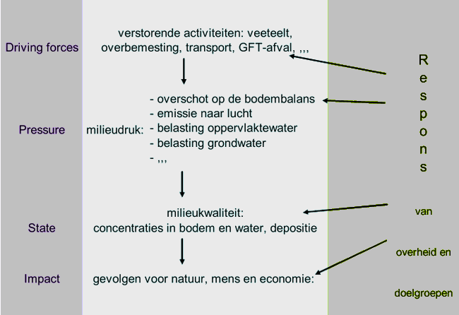{ width=70% }

In de context van een milieudruk onderscheiden we twee bijzondere types van standplaatsfactoren:

- **P-proxies**: standplaatsfactoren die in de procesketen kort na de milieudruk optreden;
- **I-proxies**: standplaatsfactoren die door de milieudruk (vroeg of laat in de procesketen) worden beïnvloed én die de vegetatie op directe wijze, d.w.z. fysiologisch beïnvloeden.

# Conceptueel systeemschema van de standplaats

## De ecologische kennis in beeld brengen

Het conceptueel systeemschema van de standplaats (kortweg conceptueel systeemschema of systeemschema) is een **visualisatietool** en een **databank** die aangeeft:

- welke standplaatsfactoren rechtstreeks of onrechtstreeks relevant zijn voor vegetatie; 
- welke van de standplaatsfactoren door de respectievelijke milieudrukken rechtstreeks of onrechtstreeks worden beïnvloed.

### Een grafische voorstelling van de standplaatsfactoren relevant voor vegetatie

Het systeemschema biedt een **grafische voorstelling van de standplaatsfactoren die op een rechtstreekse of onrechtstreekse wijze voor vegetatie relevant zijn, in de verschillende milieucompartimenten** (figuur \@ref(fig:SysteemschemaStructuur)).

Daarbij wordt gedifferentieerd tussen droge, natte en submerse standplaatsen: de *waterhuishoudingsklassen*. 

![(\#fig:SysteemschemaStructuur)Structuur van het conceptueel systeemschema van de standplaats. Van links naar rechts drie waterhuishoudingsklassen, die tevens drie types van standplaatsen vertegenwoordigen: 1. droog tot vochtig (verkort: droog), 2. tijdelijk tot permanent nat (verkort: nat), 3. oppervlaktewater (verkort: submers). De vakjes zelf stellen de milieucompartimenten voor. In elk compartiment worden de voor vegetatie (meest) relevante standplaatsfactoren weergegeven (zoals geïllustreerd met een voorbeeld voor waterbodem).](../../site/SysteemschemaStructuur.png){ width=80% }

De waterhuishoudingsklassen zijn indirect gedefinieerd via 

1. de toewijzing van types (habitat(sub)types, regionaal belangrijke biotopen) aan één of twee waterhuishoudingsklassen; 
2. de toewijzing van verschillende milieucompartimenten aan waterhuishoudingsklassen in het systeemschema. 

Deze keuze is gemaakt om in het systeemschema relatief eenvoudige verbanden te kunnen definiëren tussen vegetatietypes, milieucompartimenten en standplaatsfactoren.

In elk milieucompartiment zijn verschillende fasen aanwezig die in een dynamisch evenwicht met elkaar staan: een luchtfase, een vloeibare fase en een vaste fase. Zo bevat het compartiment "atmosfeer" een luchtfase samengesteld uit stikstofgas, zuurstofgas, waterdamp en andere sporengassen, maar ook water onder vloeibare vorm (vloeibare fase) en vaste aerosolen zoals opwaaiend zeezout, klei- en stofdeeltjes, vulkaanstof en verbrandingsdeeltjes (vaste fase). Op een gelijkaardige manier betreft het compartiment "bodem" zowel de bodemlucht (luchtfase), als de bodemoplossing (vloeibare fase) en de bodempartikels (vaste fase).
Elke standplaatsfactor in het systeemschema staat voor een verzameling van mogelijke (meetbare) milieuvariabelen in de verschillende fasen van een milieucompartiment.

Een aantal elementen zijn onlosmakelijk met elkaar verbonden:

- de milieucompartimenten die in een waterhuishoudingsklasse voorkomen (bv. bodem, waterkolom, ...);
- de standplaatsfactoren die in een milieucompartiment x waterhuishoudingsklasse voorkomen;
- één fysieke standplaats behoort tot één waterhuishoudingsklasse;
- een type (habitattype/regionaal belangrijke biotoop) komt op verschillende (fysieke) standplaatsen voor, in één (of -- voor een beperkt aantal types -- meerdere) waterhuishoudingsklasse(n).

Het conceptueel systeemschema bundelt de wetenschappelijke kennis over deze linken onder de vorm van schema’s en een databank. 

### Invloed van de milieudrukken op de standplaatsfactoren

Daarbovenop wordt aangeduid **welke van de standplaatsfactoren door de respectievelijke milieudrukken op een rechtstreekse of onrechtstreekse wijze worden beïnvloed**, samen met de richting van verandering (positief of negatief). Figuur \@ref(fig:SysteemschemaEutrofieringLucht) toont hoe de invloed van een milieudruk in het systeemschema wordt weergegeven, voor het voorbeeld *eutrofiëring via de lucht*.

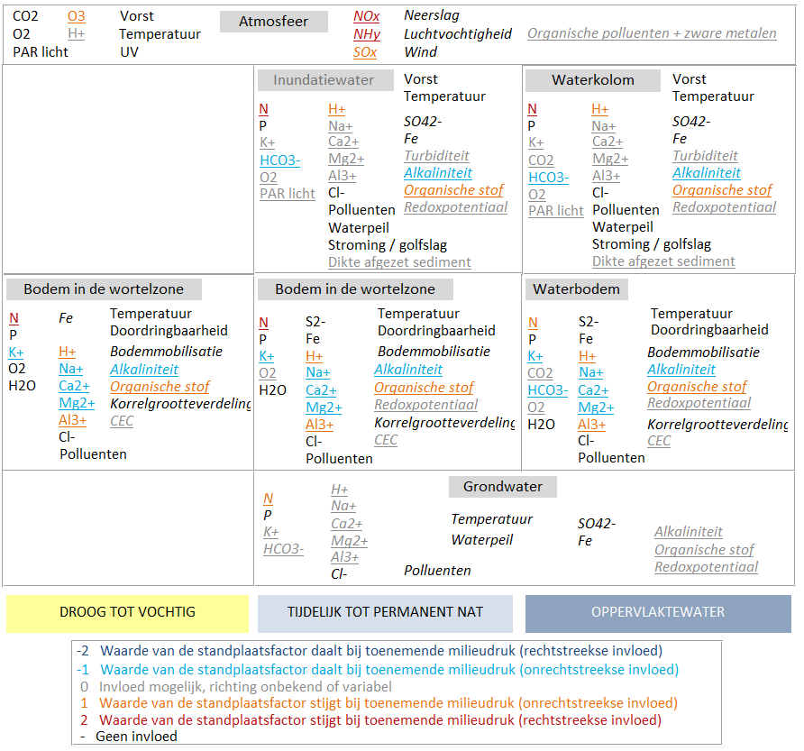{width=85%} 

De invloed van een milieudruk laat zich meestal over de grenzen van de milieucompartimenten en de waterhuishoudingsklassen heen voelen.
We kunnen deze **procesketens in het systeemschema** voorstellen, zoals geïllustreerd in het voorbeeld in figuur \@ref(fig:pathways-theory). Conform het model van het [DPSIR-keten](#anchor-DPSIR) kunnen we hiermee standplaatsfactoren identificeren die kunnen dienen als

- P-proxies (in donkerrood/donkerblauw in figuur \@ref(fig:pathways-theory)): dat zijn de standplaatsfactoren die in de procesketen kort na de milieudruk optreden; 
- I-proxies: dat zijn de standplaatsfactoren die door de milieudruk worden beïnvloed én die de vegetatie op directe wijze beïnvloeden. Ze kunnen in alle compartimenten voorkomen.

![(\#fig:pathways-theory)Voorbeeld van voorstelling van een procesketen van een milieudruk, binnen en tussen standplaatsen. De grafische kadervorm van het systeemschema wordt voorgesteld, met daarbinnen telkens van links naar rechts drie waterhuishoudingsklassen van droog tot oppervlaktewater. De vakjes zelf stellen de milieucompartimenten voor.<br> 
Legende:<br>
- bolletjes/vierkantjes = standplaatsfactoren;<br> 
- vierkantje: de standplaatsfactor die meest rechtstreeks (= eerst) door de milieudruk wordt beïnvloed;<br>
- gekleurde lijnen = effectrelaties waarbij verandering in de ene standplaatsfactor effect heeft op verandering in de andere;<br>
- donkerrood/donkerblauw: een effectrelatie of beïnvloede standplaatsfactor, die overeenkomt met een rechtstreekse invloed van de milieudruk in de keten (dit zijn steeds P-proxies);<br> 
- lichtblauw/oranje: een effectrelatie of beïnvloede standplaatsfactor, die overeenkomt met een onrechtstreekse invloed van de milieudruk in de keten;<br> 
- grijs: een effectrelatie of beïnvloede standplaatsfactor waarop niet noodzakelijk een effect is te verwachten (maar wel onder bepaalde omstandigheden) en/of waarop een effect is te verwachten waarbij de richting (positief/negatief) van omstandigheden zal afhangen.
](Pathways_theory.png){width=55%} 

Merk op dat het systeemschema zich niet even goed leent tot alle milieudrukken: milieudrukken die de standplaatsfactoren amper of niet beïnvloeden of die rechtstreeks diersoorten aantasten, werden dus niet opgenomen in het systeemschema:

- 14 Verlies van aquatische connectiviteit;
- 15 Verlies van terrestrische connectiviteit;
- 9.1 Geluid en trillingen;
- 9.2 Licht en straling;
- 9.3 Beweging en andere visuele verstoring.

## De databank/applicatie

Het systeemschema steunt op een kleine MS Access applicatie: de databank wordt gebruikt om de gegevens te stockeren maar biedt ook formulieren om de data op een gebruikersvriendelijke manier te raadplegen en te wijzigen.

### Structuur van de databank (in een notendop)

Figuur \@ref(fig:Systeemschema-db-structuur-simpl-col) hieronder geeft een vereenvoudigd overzicht van de structuur van de databank.

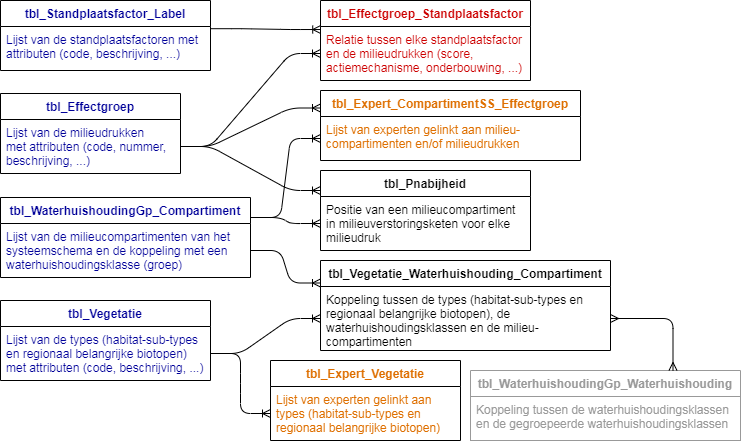

De belangrijkste tabellen kunnen als volgt worden beschreven: 

- Vier **basistabellen** (in het blauw) bevatten lijsten van de gebruikte **milieudrukken** (*tbl_Effectgroep*), **standplaatsfactoren** (*tbl_Standplaatsfactor_Label*), **milieucompartimenten** (*tbl_WaterhuishoudingGp_Compartiment*) en **types** (*tbl_Vegetatie*), alsook hun attributen (bv. code, nummer, beschrijving, label, ...).

- Twee tabellen (in het groen) geven een overzicht van de **experten** die gespecialiseerd zijn in enerzijds bepaalde **vegetatietypes** (*tbl_Expert_Vegetatie*) en anderzijds bepaalde **milieudrukken/milieucompartimenten** (*tbl_Expert_CompartimentSS_Effectgroep*).

- De tabel *tbl_Vegetatie_Waterhuishouding_Compartiment* geeft voor elke (vegetatie)type aan welke milieucompartimenten relevant zijn (bv. habitat-sub-types die in valleien voorkomen worden gelinkt met het milieucompartiment 'Inundatiewater' binnen de waterhuishoudingsklasse 'Tijdelijk tot permanent nat', in tegenstelling tot habitat-sub-types van de droge milieus).

- De tabel *tbl_Pnabijheid* definieert voor elke milieudruk de positie van elk milieucompartiment in de milieuverstoringsketen (zie [hoger](#anchor-DPSIR)) met een cijfercode gaande van 1 (aan de bron van de milieudruk) tot 3 (verder in de verstoringsketen). Milieucompartimenten die niet beïnvloed worden door een bepaalde druk krijgen de cijfercode 0 (= niet van toepassing).

- De tabel *tbl_Effectgroep_Standplaatsfactor* (in het rood) vormt de kern van de databank. Deze tabel beschrijft de **relatie tussen milieudrukken en standplaatsfactoren**: hoe evolueert de waarde van de standplaatsfactor bij een toenemende milieudruk? Via welke actiemechanisme(n)? Hoe goed is de relatie tussen standplaatsfactor en milieudruk gedocumenteerd? Bestaan er referenties uit de literatuur of datasets die deze relatie onderbouwen?

Voor een gedetailleerde beschrijving van de structuur van de databank verwijzen we naar [bijlage 2](#anchor-structuur-db). 

### Gebruik van de applicatie

De gebruiker krijgt een **overzicht van de relaties tussen milieudrukken en standplaatsfactoren** via twee hoofdformulieren:

1. een formulier in **tabelvorm** (*frm_Cross_Effectgroep_Standplaatsfactor, Standplaatsfactoren - effectgroepen*) dat bij het openen van de databank automatisch verschijnt; 


2. een formulier dat een **grafische voorstelling** van het **systeemschema** van de standplaats weergeeft (*frm_Systeemschema, Systeemschema van de standplaats*).

{width=75%}

De score die de relatie tussen een standplaatsfactor en een milieudruk aangeeft kan via deze twee formulieren worden geraadpleegd.  In een derde **detailformulier** (figuur \@ref(fig:Systeemschema-db-frm-detail)) krijgt de gebruiker de mogelijkheid om de **relatie tussen standplaatsfactoren en milieudruk per compartiment** te **wijzigen** en te **documenteren**. Hierbij kunnen verschillende velden ingevuld worden:

* *score*: geeft de relatie aan tussen een standplaatsfactor en een milieudruk:

  | Score | Betekenis                                 | Kleurcode | 
  |:-----:|:------------------------------------------|:--------|
  |   -2  |  Waarde van de standplaatsfactor daalt bij toenemende milieudruk (rechtstreekse invloed)    |    Donkerblauw   |
  |  -1  |  Waarde van de standplaatsfactor daalt bij toenemende milieudruk (onrechtstreekse invloed)  |   Lichtblauw   |
  |    0  |    Impact mogelijk, richting onbekend of variabel  |     Grijs   |
  |    1  |    Waarde van de standplaatsfactor stijgt bij toenemende milieudruk (onrechtstreekse invloed) |     Oranje   |
  |    2  |    Waarde van de standplaatsfactor stijgt bij toenemende milieudruk (rechtstreekse invloed)  |     Rood   |

* *onderbouwing van de score*: geeft aan in welke mate de relatie tussen standplaatsfactor en effectgroep gedocumenteerd is:
  
  | Naam             | Betekenis                                 | 
  |:-----------------|:------------------------------------------|
  |   Expertkennis of ervaring  |  Geen of nauwelijks gepubliceerde gegevens.   |
  |  Matige wetenschappelijke bewijskracht  |  Grijze literatuur, weinig bronnen beschikbaar of tegenstrijdige data.  |
  |    Sterke wetenschappelijke bewijskracht  |    A1 publicaties, verschillende bronnen die overstemmen.   |

* *actiemechanisme*: korte uitleg of voorbeeld om de link tussen de milieudruk en de standplaatsfactor te verduidelijken. Dit is vooral belangrijk als de relatie tussen de standplaatsfactor en de milieudruk onrechtstreeks is of habitatspecifiek.  

* *opmerkingen*: andere opmerkingen met betrekking tot de relatie tussen standplaatsfactor en milieudruk.  

* *referenties*: relevante studies of datasets kunnen hier vermeld worden.  

{width=75%}

Voor een praktische handleiding voor het gebruik van de Access applicatie verwijzen we naar het helpbestand dat geraadpleegd kan worden in de databank/applicatie zelf (knop 'Help' of *frm_Info*).

# Doorwerken van de milieudrukken op standplaatsfactoren

Hieronder wordt van de **milieudrukken** meer in detail beschreven hoe zij **doorwerken op standplaatsfactoren in de milieucompartimenten** (zie ook figuur \@ref(fig:pathways-theory)). Dit hoofdstuk biedt meer duiding bij de interpretatie van het conceptueel systeemschema en kan best naast het formulier 'frm_Systeemschema' (Systeemschema van de standplaats, figuur \@ref(fig:Systeemschema-db-frm-schema)) worden geraadpleegd.

## 11 Aanpassing fysische structuur naar een blijvende nieuwe toestand {-}

Deze druk komt binnen ter hoogte van de bodem in terrestrische en aquatische systemen en kan zeer uiteenlopende vormen nemen: bodemcompactie, verharding, herprofilering, aanvoer van een nieuw substraat, grondverzet, … De omvang en richting van de impact op de verschillende standplaatsfactoren hangt samen met de aard van de ingreep. Twee aspecten van de milieudruk werden nader bekeken: bodemcompactie en grondverzet. 

### 111 Bodemcompactie {-}

Compactie tast de bodemstructuur aan en kan een impact hebben op:  

* de aeratie van de bodem: de uitwisseling van gassen zoals CO2 en zuurstof verloopt trager in gecompacteerde bodems;
* de doorlaatbaarheid van de bodem voor water: er zijn negatieve effecten op niveau van de betroffen standplaats (compartiment bodem) maar ook mogelijke impacts op de milieucompartimenten grondwater, inundatiewater en waterkolom: het water (hetzij als regenwater of inundatiewater) sijpelt moeilijker door de bodem en kan zelfs blijven stagneren, het regenwater bereikt de plantenwortels minder snel, infiltratie naar het diepere grondwater kan worden geremd of beperkt;  
* de doordringbaarheid voor o.a. plantenwortels en bodemfauna die afneemt;
* de stabiliteit van de bodem (standplaatsfactor bodemmobilisatie in milieucompartiment bodem).  

### 112 Grondverzet {-}  

Na de ingreep zullen de aard en de structuur van het substraat veranderd zijn (milieucompartiment bodem of waterbodem): zowel de bodemtextuur (korrelgrootteverdeling) als het gehalte aan organisch materiaal (en de kationeneuitwisselingscapaciteit die samen met deze kenmerken hangt) kunnen worden beïnvloed. De richting waarin deze standplaatsfactoren evolueert is afhankelijk van de aard van de gronden die worden aan-/weggevoerd. Ook de structuur van de bodem zal aangetast worden: recent opgehoogde terreinen en taluds zullen bijv. minder stabiel zijn (meer bodemmobilisatie mogelijk), de lucht- en watercirculatie zal anders verlopen en de doordringbaarheid van de bodem kan veranderen. Deze impacts op de bodemstructuur kunnen op hun beurt de waterhuishouding beïnvloeden (compartimenten grondwater, inundatiewater en waterkolom).

## 12 Toename bodemdynamiek en 13 afname bodemdynamiek {-}

Gezien de gelijkaardige pathways worden de beide milieudrukken hier samen behandeld.

Deze drukken komen binnen ter hoogte van de bodem: de verandering in frequentie van fysische bodemverstoring kan zowel terrestrisch als aquatisch zijn, en zowel betrekking hebben op verandering in frequentie van mechanische omwoeling/baggeren/... door mensen, als op veranderingen in wind- of waterstroming die de bodemverstoring beïnvloeden. De druk beïnvloedt rechtstreeks de mate van bodemmobilisatie. Als de bodem onder water staat, wordt ook een impact op de turbiditeit van het water en eventueel op de afzetting van sediment verwacht (compartimenten inundatiewater en waterkolom).

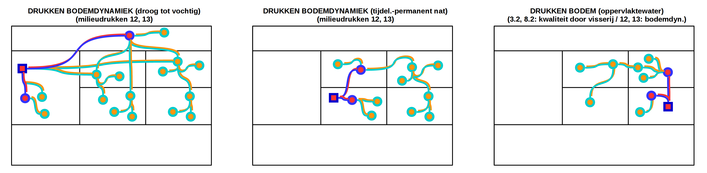{width=100%} 

## Eutrofiëring {-}

### 3.1 Eutrofiëring via de lucht {-}

Deze milieudruk komt ter hoogte van de standplaats aan onder de vorm van NOx en/of NHy in de atmosfeer. Deze componenten zijn meest proximaal aan de pressure. Zij beïnvloeden rechtstreeks de nitraat- en ammoniumconcentraties in het bovenste milieucompartiment van terrestrische en aquatische systemen (toename). Onrechtstreeks worden in deze compartimenten beïnvloed:  

-	door omzettingen en assimilatie: organische stof (en onder bepaalde omstandigheden daarmee verwante factoren zoals afgezet sediment, licht, O2, redoxpotentiaal en CEC), en overige N-fracties;  
-	door de verzuringsprocessen: diverse componenten van de zuur-basenhuishouding. Daaronder is tevens de uitloging van basekationen begrepen. In het oppervlaktewater kan het effect op bepaalde ionen afhangen van eventuele compenserende aanvoerstromen.  
Onrechtstreeks worden ook de nitraat- en ammoniumconcentraties van waterbodem en grondwater beïnvloed (toename), en worden mogelijks (maar niet altijd) ook standplaatsfactoren, verwant met bovenstaande onrechtstreekse omzettingen, beïnvloed.

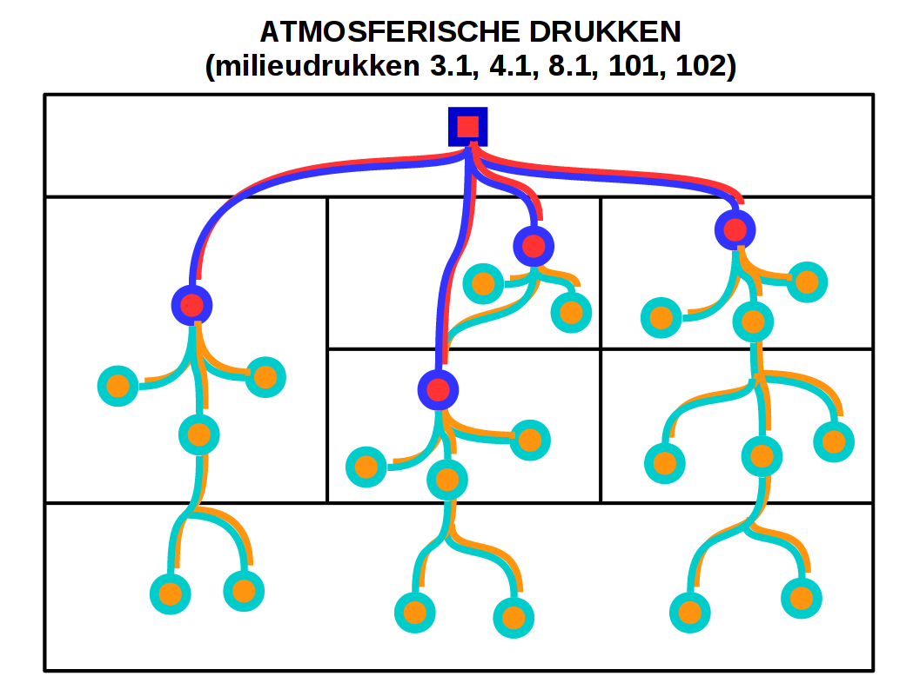{width=33%} 

### 3.2 Eutrofiëring via de bodem {-}

Deze milieudruk komt in eerste plaats ter hoogte van de standplaats aan onder de vorm van nitraat, ammonium, fosfaat of andere N- of P-fracties die aan de bodem worden toegediend of uit de bodem worden vrijgesteld (bijv. via mineralisatie van normaliter onbeschikbare nutriënten). De bodemcompartimenten bevatten dus de standplaatsfactoren die het meest proximaal zijn aan de druk. Naast N en P geldt deze druk ook voor de toediening van andere macro- en micronutriënten en mineralen, alsook voor andere stoffen die met de nutriënten  'meeliften' (bv. Cl in Cl-houdende Kalium-kunstmesttoffen). Door omzettingen en assimilatie kan ook het gehalte aan organische stof beïnvloed worden (en onder bepaalde omstandigheden daarmee verwante factoren zoals afgezet sediment, licht, O2, redoxpotentiaal en CEC),  

In aquatische systemen kan nutriëntenvrijstelling uit de onderwaterbodem plaatsvinden omwille van viskweek/vissport: de toename die dan plaatsvindt wordt evengoed beschouwd als een rechtstreekse invloed van deze milieudruk. Dit verschijnsel kan bij overstroming leiden tot een (onrechtstreekse) verandering in nutriëntenconcentraties in inundatiewater.

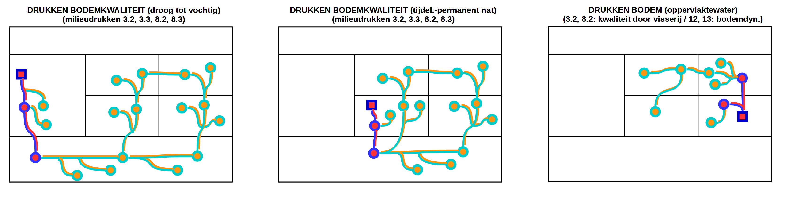{width=100%} 

### 3.3 Eutrofiëring via het grondwater {-}

Deze milieudruk komt ter hoogte van de standplaats aan onder de vorm van nitraat, ammonium, fosfaat of andere N- of P-fracties in het grondwater, hetzij op aquatische standplaatsen, hetzij op (tijdelijk tot permanent natte) terrestrische standplaatsen. De oorspronkelijke bron is echter meestal te situeren in hoger gelegen nutriëntenrijke gronden. Naast N en P geldt deze druk ook voor andere macro- en micronutriënten en mineralen, alsook voor andere stoffen/bijproducten die met de nutriënten  'meeliften' (bv. Cl in Cl-houdende Kalium-kunstmesttoffen). Door omzettingen en assimilatie kan ook het gehalte aan organische stof beïnvloed worden (en onder bepaalde omstandigheden daarmee verwante factoren zoals afgezet sediment, licht, O2, redoxpotentiaal en CEC). 

Deze druk dekt ook de toename aan nutriëntenbeschikbaarheid die door interne eutrofiëring kan optreden (nutriënten die in het systeem al aanwezig waren maar worden vrijgesteld door de grondwateraanvoer van sulfaat).

{width=100%} 

### 3.4 Eutrofiëring via het oppervlaktewater {-}

Deze milieudruk komt ter hoogte van de standplaats aan onder de vorm van nitraat, ammonium, fosfaat of andere N- of P-fracties in het oppervlaktewater, hetzij op aquatische standplaatsen, hetzij op terrestrische standplaatsen via overstromingswater afkomstig van (of in open verbinding met) geëutrofieerde aquatische standplaatsen. Typisch zijn deze invloeden geassocieerd met basekationen en geregeld met meer chloride. Al deze componenten zijn dus in beide oppervlaktewatercompartimenten meest proximaal aan de pressure, hoewel ze niet noodzakelijk allemaal tesamen van toepassing zijn. Onrechtstreeks worden in deze compartimenten eigenschappen beïnvloed die samenhangen met de hoeveelheid organische stof, vermits de eutrofiëring doorgaans leidt tot meer biomassa. Afhankelijk van een andere zuur-basenhuishouding van het toekomende water, kunnen deze compartimenten een veranderde  zuur-basenhuishouding krijgen. Onrechtstreeks worden ook de overeenkomstige eigenschappen van natte terrestrische bodems en van waterbodems beïnvloed, en nog meer onrechtstreeks die van het grondwater.

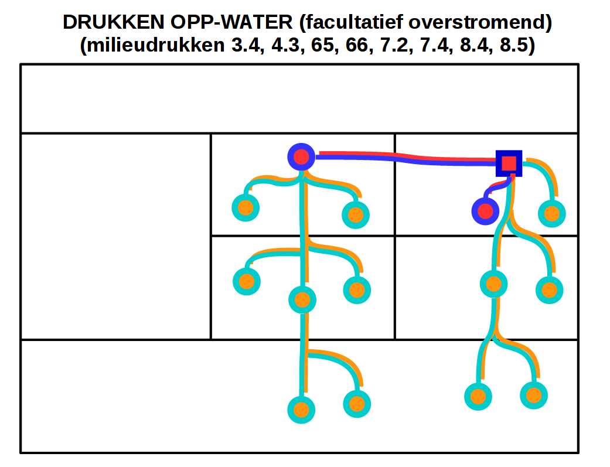{width=33%} 

## Verzuring {-}

### 4.1 Verzuring via de lucht {-}

Deze milieudruk komt ter hoogte van de standplaats aan onder de vorm van de polluenten NOx, NHy en/of SOx in de atmosfeer. In het geval van de geoxideerde atmosferische vormen van N of S, gebeurt door reactie met water de omzetting naar de sterke zuren salpeterzuur en zwavelzuur. Daarmee is bij die polluenten ook H+ een aangevoerde component die de essentie van deze milieudruk uitdrukt, namelijk de verzurende werking. In het geval van NHy treedt de verzuring op na nitrificatie onder aërobe omstandigheden in bodem of oppervlaktewater. Deze vier componenten zijn meest proximaal aan de pressure, hoewel ze niet allemaal samen hoeven op te treden. Rechtstreeks worden aldus de H+ concentratie (pH) en de concentraties aan voornoemde N-/S-componenten beïnvloed in het bovenste milieucompartiment van terrestrische en aquatische systemen (toename). Onrechtstreeks worden in deze compartimenten beïnvloed:  

*	door de remming van mineralisatie bij lage pH: toename van organische stof (en daarmee verwante factoren zoals redoxpotentiaal), en overige N-fracties;  
*	door de toevoer van sulfaat: sulfidevorming in natte terrestrische en aquatische bodems;  
*	door de verzuringsprocessen: diverse componenten van de zuur-basenhuishouding. In het oppervlaktewater kan het effect op bepaalde ionen afhangen van eventuele compenserende aanvoerstromen. 

Onrechtstreeks worden ook overeenkomstige concentraties van waterbodem en grondwater beïnvloed.

{width=33%} 

### 4.2 Verzuring via het grondwater {-}

Verzuring via het grondwater kan optreden op aquatische standplaatsen, en op (tijdelijk tot permanent natte) terrestrische standplaatsen die in contact staan met grondwater. Deze milieudruk kan ter hoogte van de standplaats aankomen onder de vorm van zuren in het grondwater of stoffen in het grondwater die zuurvorming teweegbrengen in de standplaats. De oorspronkelijke bron is dan meestal te situeren in hoger gelegen gronden die blootgesteld worden aan verzuring via de lucht. Ook een verminderde aanvoer van zuurneutraliserende stoffen (bv. bij een verminderde grondwateraanvoer in bodems of waterlichamen met een lage buffercapaciteit) kan tot verlaging in de wortelzone leiden van de verhouding van aanvoer/productie van bufferende stoffen t.o.v. zuurvormende verbindingen.

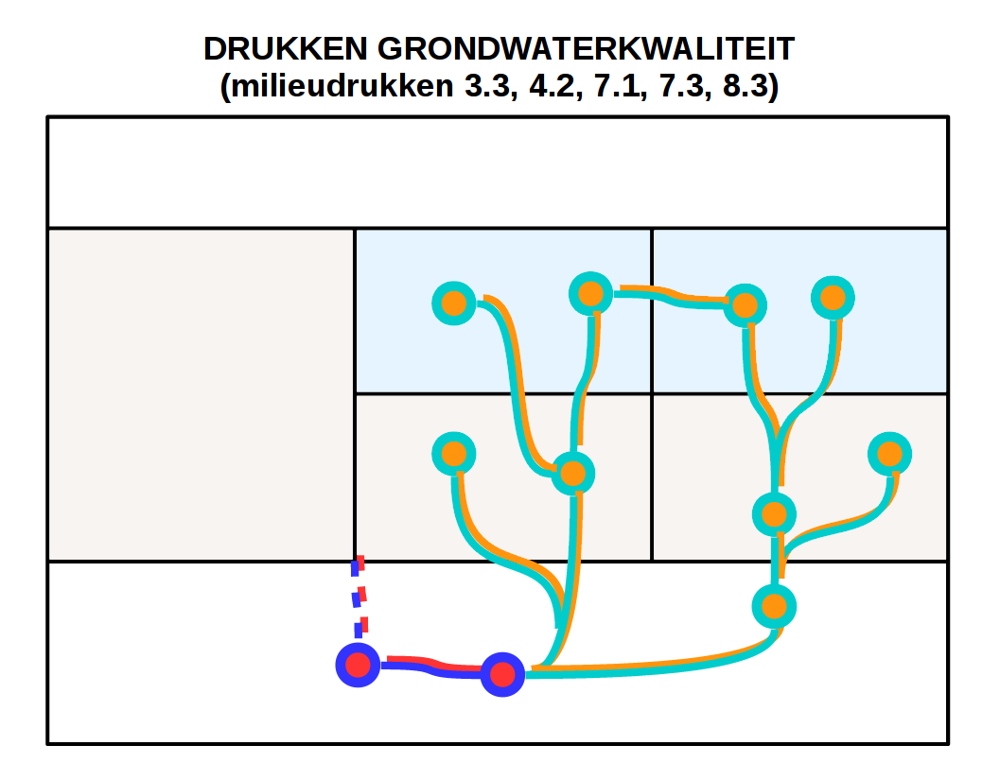{width=33%} 

### 4.3 Verzuring via het oppervlaktewater (incl. overstromingswater) {-}

Verzuring via oppervlaktewater wordt veroorzaakt door een wijziging (kwantitatief of kwalitatief) van de toevoer via het oppervlaktewater van zuren, zuurvormende verbindingen en/of bufferende stoffen. Aanvoer van deze stoffen gebeurt via oppervlaktewater, inclusief overstromingswater, runoff en stagnerend regenwater. Protonen, basische kationen en alkaliniteit in de compartimenten inundatiewater en oppervlaktewater zijn de standplaatsfactoren meest proximaal aan de pressure.

{width=33%} 

## Wijziging grondwaterstand {-}

### 5.1 Verdroging en 5.2 vernatting {-}

Gezien de gelijkaardige pathways worden de beide milieudrukken hier samen behandeld.

De druk komt binnen ter hoogte van het grondwater. In het geval van verdroging is dit als gevolg van een toename in de grondwaterafvoer (door meer onttrekking, meer drainage, meer evapotranspiratie, …). In het geval van vernatting geldt het omgekeerde. De druk begint hetzij hoger in het landschap (ter hoogte van infiltratiegebied/valleiflanken, onder de droge tot vochtige standplaatsen), hetzij lager in het landschap (ter hoogte van valleien en dus natte bodems). In beide gevallen is het effect op grondwaterpeil meest proximaal aan de pressure. In het conceptueel systeemschema figureert dit niet ter hoogte van de droge tot vochtige bodems, omdat er onder die condities geen typisch vegetatierelevante standplaatsfactoren in het grondwater zijn gesitueerd (voor de droge tot vochtige standplaatsen). Het effect van grondwaterpeilverandering heeft niet noodzakelijk effecten op de grondwaterchemie, hoewel dit niet is uit te sluiten. Er is een rechtstreekse impact van de waterpeilverandering op:  

-	de hoeveelheid beschikbaar water in de natte bodem. Door het meer of minder beschikbaar worden van O2 zijn onrechtstreekse gevolgen te verwachten op de zuur- en de nutriëntenhuishouding, vooral door de veranderde afbraaksnelheid van organisch materiaal. Daarbij zal het effect op nitraat en sulfide meest consequent optreden in verschillende situaties, en kan het effect op andere standplaatsfactoren meer variëren afhankelijk van de situatie. Bij vernatting of verdroging is het moeilijker te bepalen of ‘andere N-fracties’ toe- of afnemen, omdat zij dikwijls een tussenproduct zijn in de afbraak van organische stof tot minerale stikstof, en ze dus kunnen accumuleren door versnelde afbraak van organische stof of door vertraagde afbraak tot minerale stikstof.  
-	het waterpeil van oppervlaktewateren, in zoverre in een landschap de peilwijziging van het grondwater zich tot deze locaties uitstrekt en het oppervlaktewaterpeil in bepaalde mate (bv. in de zomerperiode) grondwatergestuurd is. Een standplaats in een oppervlaktewater zal, wanneer er door de milieudruk meer of minder droogval optreedt in het jaar, effecten kennen in zowel oppervlaktewater- als waterbodemchemie. Dit is primair het gevolg van de zuurstofgestuurde processen die bij droogval optreden in de waterbodem, analoog aan de processen in natte bodems. Wanneer de standplaats zowel zonder als met de milieudruk een permanente waterkolom kent, is minder een verandering te verwachten in de waterbodem. De chemie van de waterkolom blijft er in regel wel aan verandering onderhevig, gezien de menging die optreedt met de waterkolom van ondiepere (oever)standplaatsen in dit oppervlaktewater (waar wel wijziging plaatsvindt in droogvalregime).

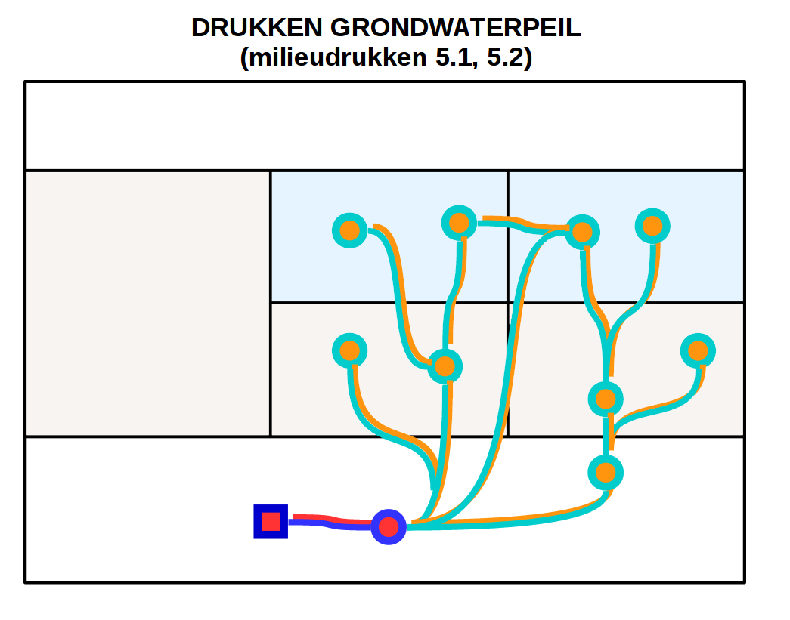{width=33%} 

## Wijziging van de hydrologie van een oppervlaktewaterlichaam {-}

### 61 Toename en 62 afname overstromingsduur of -frequentie (incl. getijden) {-}

Gezien de gelijkaardige pathways worden de beide milieudrukken hier samen behandeld.

Onder deze milieudrukken wordt een toename (respectievelijk afname) begrepen in het optreden en de inundatiekarakteristieken van overstromingen. Meest proximaal aan deze pressure zijn dan ook het waterpeil (en daarin begrepen fluctuatiekenmerken) en de sedimentatiehoeveelheid van het overstromingswater, die toenemen/afnemen door de toename/afname van overstroming. Deze wijzigingen hebben een afgeleid effect op mogelijks allerlei kenmerken van de natte (terrestrische) bodems onder dit overstromingswater, en van aquatische milieus die voorheen niet of minder/of net vaker door overstromingen (van elders afkomstig) werden beïnvloed.  

Welke kenmerken worden beïnvloed, hangt grotendeels af van de specifieke kenmerken van het overstromingswater en van frequentie en duur van overstromingen. 
Bij een toename van overstromingsduur of frequentie leidt een toename van sedimentatie en inundatie tot een afname van zuurstof en redoxpotentiaal, in natte bodems tevens tot een vochttoename, en in door overstroming beïnvloed oppervlaktewater tevens tot een toename van turbiditeit (+ afname van plantbeschikbaar licht) en waterpeilen. Onrechtstreeks stijgt door infiltratie ook het waterpeil van grondwater in terrestrische systemen. Bij een afname van overstromingsduur of frequentie evolueren deze standplaatsfactoren in de tegenovergestelde richting.

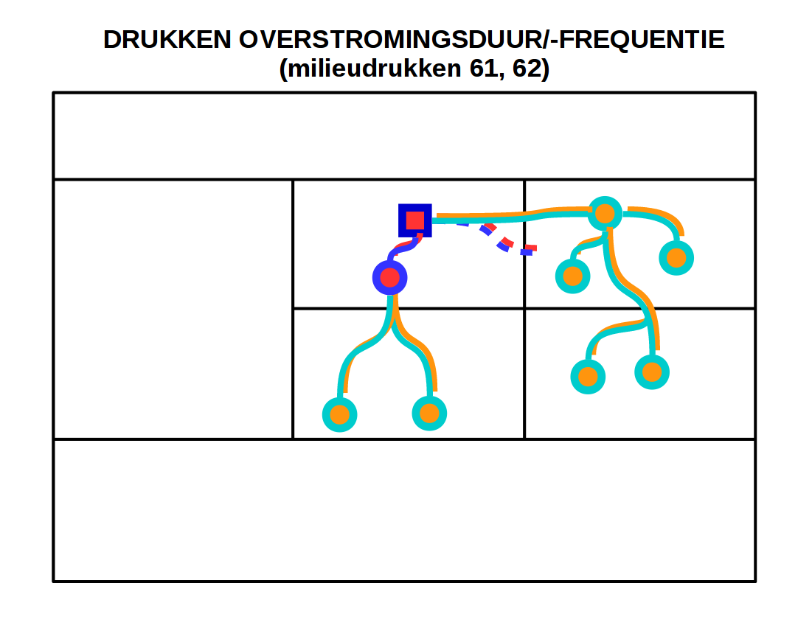{width=33%} 

### 63 Toename en 64 afname van stroomsnelheid, waterpeil en/of de fluctuatie ervan {-}

Gezien de gelijkaardige pathways worden de beide milieudrukken hier samen behandeld.

Onder deze milieudrukken begrijpen we een wijziging, i.e. een toe- of een afname, van de stroomsnelheid en/of van de verblijftijd en/of van het waterpeil in stilstaande of stromende wateren. Het effect is in eerste instantie van toepassing in de waterkolom en binnen de bedding van een waterlichaam: de standplaatsfactoren waterpeil, stroming/golfslag en bodemmobilisatie in de compartimenten oppervlaktewater, inundatiewater en waterbodem zijn meest proximaal aan de pressure. Als het oppervlaktewaterlichaam in contact staat met een grondwaterlichaam kan het grondwaterpeil echter ook (onrechtstreeks) worden beïnvloed.

{width=33%} 

### 65 Toename en 66 afname golfslagwerking {-}

Gezien de gelijkaardige pathways worden de beide milieudrukken hier samen behandeld.

Deze drukken komen binnen ter hoogte van de waterkolom en eventueel van het inundatiewater. In deze compartimenten verandert de intensiteit van golfslagwerking (standplaatsfactor stroming/golfslag), wat leidt - afhankelijk van de richting van de verandering - tot een afname of toename van de turbiditeit en van de hoeveelheid licht dat beschikbaar is voor de levende organismen (standplaatsfactor PAR licht). In de vorstperioden wordt de vorming van ijs aan de wateroppervlakte evengoed rechtstreeks gecontroleerd door de golfslagwerking. Daarnaast kunnen golven de structuur en stabiliteit van de waterbodem aantasten (standplaatsfactor bodemmobilisatie). 

Afhankelijk van de lokale omstandigheden kan een verandering in golfslagwerking ook andere standplaatsfactoren beïnvloeden. Enkele voorbeelden van de mogelijke gevolgen van een toename in golfslag zijn:

- meer erosie en meer slibafzetting;
- in wateren met kleiige en slibrijke bodem:een zuurstofverarming als gevolg van een lager doorzicht;
- een hogere beschikbaarheid van nutriënten door uitwisseling met waterkolom en betere afbraak van organische sedimentfractie.

{width=33%} 

## Verzoeting en verzilting {-}  

Verzoeting en verzilting zijn per definitie uitsluitend gesitueerd in de kustduinen en de polders. Een wijziging van het chloridegehalte in het milieu door het onttrekken of toevoeren van zouten (bv. door strooizout) of van verbindingen die de vorming van zouten beïnvloeden, wordt tot de milieudruk 'Verontreiniging' gerekend.

### 7.1 Verzoeting en 7.3 verzilting via het grondwater {-}

Gezien de gelijkaardige pathways worden de beide milieudrukken hier samen behandeld.

Deze milieudrukken hebben betrekking op de wijziging van het zoutgehalte (o.a. natriumchloride, sulfaat) in het milieu ten gevolge van wijzigingen in grondwaterhuishouding, hetzij in grondwaterkwaliteit, hetzij in grondwaterdynamiek. 
Ze kunnen dus optreden op aquatische standplaatsen, en op (tijdelijk tot permanent natte) terrestrische standplaatsen die in contact staan met grondwater. 

De componenten die meest proximaal zijn aan de pressure omvatten verbindingen in het grondwater: zouten zoals natriumchloride en sulfaten, of verbindingen die de vorming van zouten beïnvloeden. De aanwezigheid van zouten heeft niet enkel een rechtstreekse (fysiologische) impact op de aanwezige organismen. Verzilting in kleiige gronden kan ook onrechtstreeks negatieve gevolgen hebben voor de bodemstructuur: de Natrium-ionen veroorzaken dispersie van de klei-humus complexen en leiden tot verslempte bodems (standplaatsfactoren doordringbaarheid en bodemmobilisatie).

Ook wijziging in grondwaterdynamiek kunnen leiden tot een verandering in de zoet-zout gradiënt, en kunnen resulteren in verzilting of verzouting. Dit geldt voor alle grondwaterlichamen die met de zee of een ander zoutwaterlichaam in verbinding staan. Bv. het pompen uit, of draineren van een zoetwaterlens in poldergraslanden kan leiden tot opstuwing van de onderliggende zoutwaterlagen, waardoor de vegetatie in de slenken verzilt.

{width=33%} 

### 7.2 Verzoeting en 7.4 verzilting via het oppervlaktewater (incl. overstromingswater) {-}  

Gezien de gelijkaardige pathways worden de beide milieudrukken hier samen behandeld.

Deze milieudrukken hebben betrekking op de wijziging van het zoutgehalte (o.a. natriumchloride, sulfaat) in het milieu ten gevolge van wijzigingen in de oppervlaktewaterhydrologie, hetzij in kwaliteit, hetzij in dynamiek of hydromorfologie. 
Aanvoer van zouten of van verbindingen die de vorming van zouten beïnvloeden gebeurt via oppervlaktewater, inclusief overstromingswater en runoff. Zouten in de compartimenten oppervlaktewater en inundatiewater zijn meest proximaal aan de pressure. Er zijn echter ook onrechtstreekse effecten: Natrium-ionen veroorzaken dispersie van de klei-humus complexen en leiden tot verslempte bodems (standplaatsfactoren doordringbaarheid en bodemmobilisatie)

Ook veranderingen in oppervlaktewaterdynamiek of hydromorfologie kunnen deze milieudrukken veroorzaken: bv. door het wijzigen van het dwars- of lengteprofiel van een oppervlaktewaterlichaam dat met de zee of een ander zoutwaterlichaam in verbinding staat kan de getijwerking veranderen en kan verzilting of verzoeting optreden. 

{width=33%} 

## Verontreiniging {-}

Onder deze milieudruk verstaan we de toename in het milieu van polluenten, d.w.z. stoffen die onder natuurlijke omstandigheden ter plaatse niet of in zeer lage concentraties voorkomen. Dat kunnen allerlei milieuvreemde organische stoffen of anorganische stoffen zijn zoals polycyclische aromatische koolwaterstoffen, dioxines, polychloorbifenylen, furanen, gebromeerde vlamvertragers, geperfluoreerde organoverbindingen, hexachloorbenzeen, zouten van zware metalen, radioactieve isotopen of halogenen. Ook de toename in het milieu van andere natuurlijk voorkomende stoffen kan onder verontreiniging ressorteren als ze hun natuurlijke achtergrondconcentratie overschrijden (bijv. CO2 in de lucht). Verontreining wordt opgedeeld in subgroepen al naar gelang het medium waarlangs verontreinigende stoffen worden aangevoerd.

### 8.1 Verontreiniging via de lucht {-}

Deze milieudruk komt ter hoogte van de standplaats aan onder de vorm van verschillende polluenten in de atmosfeer, bijv. vluchtige organische stoffen, persistente organische polluenten (zoals polyaromatische koolwaterstoffen, dioxines, polychloorbifenylen en furanes), maar ook ozonafbrekende stoffen, zware metalen en broeikasgassen zoals CO2. Deze componenten zijn meest proximaal aan de pressure. Als ze in de atmosfeer onder de vorm van aerosolen voorkomen, kunnen ze als condensatiekernen fungeren en het neerslag beïnvloeden. Rechtstreeks worden de concentraties aan polluenten beïnvloed in het bovenste milieucompartiment van terrestrische en aquatische systemen (toename). Onrechtstreeks worden ook overeenkomstige concentraties van waterbodem en grondwater beïnvloed.

Welke andere standplaatsfactoren worden beïnvloed door deze druk hangt samen met het type polluent. De impacts zijn heel uiteenlopend gechloreerde en gebromeerde koolwaterstoffen hebben een rol bij de afbraak van de ozonlaag (impact op O3, UV). Veel stoffen kunnen in de bodemvocht of water reageren met andere stoffen.

{width=33%} 

### 8.2 Verontreiniging via de bodem {-}

Deze milieudruk komt ter hoogte van de standplaats aan onder de vorm van milieuvreemde polluenten in de bodem. De toename van deze polluenten gaat zeer gevalsafhankelijk samen met een toe- of afname van diverse andere eigenschappen van de bodem, en houdt een risico, op uitloging van polluenten naar het grondwater. Grondwater kan dan een vector worden naar 
andere milieucompartimenten, namelijk bodems op andere locaties, waterkolom en eventueel inundatiewater. In die milieucompartimenten is de onrechtstreekse toename van polluentconcentraties dus ook te verwachten.

In aquatische systemen kan vrijstelling van polluenten uit de onderwaterbodem plaatsvinden omwille van viskweek/vissport: de toename die dan plaatsvindt wordt evengoed beschouwd als een rechtstreekse invloed van deze milieudruk. Dit verschijnsel kan bij overstroming leiden tot een (onrechtstreekse) verandering in polluentenconcentraties in inundatiewater.

{width=100%} 

### 8.3 Verontreiniging via het grondwater {-}

Deze milieudruk komt ter hoogte van de standplaats aan onder de vorm van milieuvreemde polluenten in het grondwater (=meest proximaal aan de pressure), hetzij op aquatische standplaatsen, hetzij op (tijdelijk tot permanent natte) terrestrische standplaatsen. De oorspronkelijke bron is echter meestal te situeren in hoger gelegen verontreinigde gronden. De toename van deze polluenten gaat zeer gevalsafhankelijk samen met een toe- of afname van diverse andere eigenschappen van het grondwater, en onrechtstreeks met de overeenkomstige toe- of afnames in milieucompartimenten die in contact komen met grondwater, namelijk bodem, waterkolom en eventueel inundatiewater. In die milieucompartimenten is de onrechtstreekse toename van polluentconcentraties sowieso te verwachten.

{width=100%} 

### 8.4 Verontreiniging via het oppervlaktewater {-}

Deze milieudruk komt ter hoogte van de standplaats aan onder de vorm van milieuvreemde polluenten in het oppervlaktewater (=meest proximaal aan de pressure), hetzij op aquatische standplaatsen, hetzij op terrestrische standplaatsen via overstromingswater afkomstig van (of in open verbinding met) gepollueerde aquatische standplaatsen.  De toename van deze polluenten gaat zeer gevalsafhankelijk samen met een toe- of afname van diverse andere eigenschappen van het oppervlaktewater, en onrechtstreeks met de overeenkomstige toe- of afnames in de eronder liggende milieucompartimenten (bodem en grondwater). In die onderliggende milieucompartimenten is de onrechtstreekse toename van polluentconcentraties sowieso te verwachten.

{width=33%} 

### 8.5 Thermische verontreiniging: toename temperatuur oppervlaktewater {-}

Onder deze milieudruk verstaan we een stijging van de temperatuur van het oppervlaktewater die buiten het natuurlijk bereik van het temperatuurregime van het waterlichaam valt. Deze druk komt ter hoogte van de standplaats aan in het oppervlaktewater (compartimenten waterkolom en inundatiewater). Er is een rechtstreeks effect op de temperatuur:bij hogere watertemperatuur daalt de oplosbaarheid van zuurstof en wordt de vorming van vorst in de winter geremd. 
Daarnaast zijn er uiteenlopende onrechtstreekse effecten te verwachten zoals:

- een verhoogde oplosbaarheid van stoffen, waaronder polluenten;
- meer sulfaatreductie, en productie van sulfiden bij lage zuurstofconcentratie.

{width=33%} 

## Klimaatverandering {-}

### 101 Klimaatverandering in droge perioden en 102 klimaatverandering in natte perioden {-}

Klimaatverandering is gekenmerkt door een toename van temperatuur, wind en CO2 in de atmosfeer en door neerslagwijzigingen. Deze eigenschappen zijn meest proximaal aan deze regionale milieudruk. Omdat klimaatverandering in onze contreien tegengestelde neerslageffecten heeft in zomer en winter, zijn de hydrologische effecten hiervan opgesplitst voor zomer en winter. Omdat op een standplaats steeds de afwisseling tussen deze zomer- en wintereffecten plaatsvindt, zijn de chemische consequenties ervan niet helder en daarom niet aangeduid. Deze wijzigingen in atmosfeerkenmerken beïnvloeden rechtstreeks het bovenste milieucompartiment van terrestrische en aquatische systemen, in het bijzonder de temperatuur en vochtkarakteristieken, en in aquatische systemen het waterpeil en de CO2-concentratie. De onderliggende milieucompartimenten worden op hun beurt onrechtstreeks beïnvloed voor deze eigenschappen.

{width=33%} 

### 103 Klimaatverandering: zeespiegelstijging {-}

Onder deze milieudruk verstaan we de verhoging van de zeespiegel en de toename van het getijdenverschil als gevolg van klimaatverandering, in zodanige mate dat dit de beschouwde kust- of estuariene levensgemeenschap negatief beïnvloedt.

Dit inhoudt zowel rechtstreekse effecten in het oppervlaktewater als in het grondwater.

- in het compartiment waterkolom (en eventueel in het compartiment inundatiewater) worden een toename van golfslagwerking en waterpeil verwacht, alsook een toename van de concentraties aan zeezouten;
- ook in het compartiment grondwater neemt de concentratie aan zeezouten toe.

De zeespiegelstijging gaat ook gepaard met verzilting en leidt tot een toename van de concentraties aan zouten in de bodem die in contact komt te staan met zeewater, brakke oppervlaktewater of grondwater, en tot negatieve gevolgen van de Natrium-ionene op de bodemstructuur (meer bodemmobilisatie).

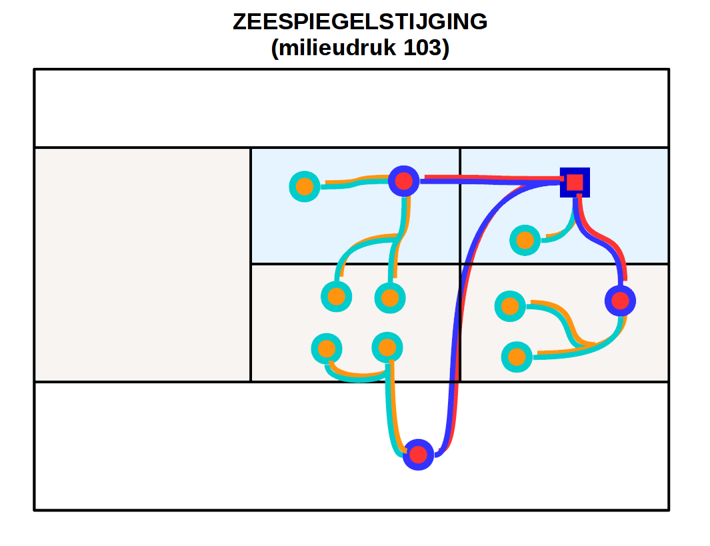{width=33%} 

# Een tool voor de selectie van standplaatsfactoren

Het systeemschema bevat voor elke milieudruk de aanduiding van:

- die standplaatsfactoren die rechtstreeks door de milieudruk worden beïnvloed;
- het compartiment dat het eerst wordt beïnvloed;
- de standplaatsfactoren die de vegetatie rechtstreeks beïnvloeden. 

Het kan aldus worden gebruikt als **afwegingskader van standplaatsfactoren**.

Afhankelijk van de beoogde toepassing kunnen we de voorrang geven aan standplaatsfactoren die in de procesketen kort na de milieudruk optreden (P-proxies) of eerder aan standplaatsfactoren die de vegetatie op directe wijze, m.a.w. fysiologisch, beïnvloeden (I-proxies), of aan een tussenoplossing.

Twee voorbeelden:

1. Het INBO ontwerpt meetnetten om de milieutoestand ter hoogte van de beschermde vegetatietypes op Vlaamse schaal te kunnen opvolgen en beoordelen op lange termijn, de zgn. [Meetnetten Natuurlijk Milieu](https://pureportal.inbo.be/nl/projects/design-and-implementation-of-flemish-monitoring-programmes-for-th). De selectie van standplaatsfactoren waarvoor lange-termijnmonitoring wordt ontworpen en geïmplementeerd wordt gebaseerd op de mate van rechtstreekse beïnvloeding door een milieudruk (P-proximiteit): standplaatsfactoren die meer rechtstreeks worden beïnvloed, krijgen een hogere prioriteit (voor meer informatie over de selectie van standplaatsfactoren voor de MNM verwijzen we naar [hoofdstukken 3 en 4 van dit document](https://drive.google.com/uc?export=download&id=1V930kfXknddFLZghzG7Tjzk04XDGmpXW)). 

2. Voor het project [HABNORM](https://pureportal.inbo.be/nl/projects/habnorm-environmental-quality-standards-for-european-protected-ha) dat een milieunormenkader ontwikkelt om de gunstige staat van instandhouding van Europees beschermde habitat(sub)types te garanderen, liggen de prioriteiten deels elders. De geselecteerde standplaatsfactoren moeten eerst en vooral een duidelijk ecologisch verband vertonen met de vegetatieontwikkeling, en meer bepaald met de staat van instandhouding van de habitats. De selectie van standplaatsfactoren wordt vervolgens beperkt tot die standplaatsfactoren die beïnvloed worden door milieudrukken veroorzaakt door maatschappelijk processen zoals landbouw, verkeer, industrie, … Hierbij weegt de nabijheid met de druk minder zwaar. 

Het systeemschema biedt een algemene benadering die geldt als een generieke basis voor de selectie van standplaatsfactoren. Complementair hieraan kunnen ook standplaatsfactoren om habitatspecifieke redenen worden geselecteerd. De selectie moet ook verder worden vernauwd op basis van o.a. haalbaarheidscriteria, om te komen tot concrete milieuvariabelen die voor een bepaald project gemeten of berekend worden.

# Bijlage 1 - Toelichting bij de interpretatie van de milieudrukken {- #anchor-milieudrukken} 

Onderstaande tabel geeft een korte toelichting bij de gebruikte milieudrukken  [@vanderhaeghe_vraagstelling_2017]. Deze informatie is ook beschikbaar als een [google spreadsheet](https://docs.google.com/spreadsheets/d/1aVUQWQlaL3k5hjuwyH-8c0lW7hjIkPz8VZbNgyMlN0A/edit?usp=sharing)).

De nummering van de milieudrukken is afgeleid uit de nummering van de effect(sub)groepen van het vergunningenbeleid.

```{r bijlage-milieudrukken, message=FALSE, echo=FALSE, warning=FALSE}
milieudrukken_def <- read_env_pressures(lang = "nl") %>% 
  select(ep_name, explanation) %>% 
  rename("Milieudruk" = "ep_name", "Betekenis" = "explanation")

knitr::kable(milieudrukken_def)
```

# Bijlage 2 - Structuur van de MS Access databank van het systeemschema van de standplaats  {- #anchor-structuur-db}

Relatie tussen de entiteiten (tabellen)

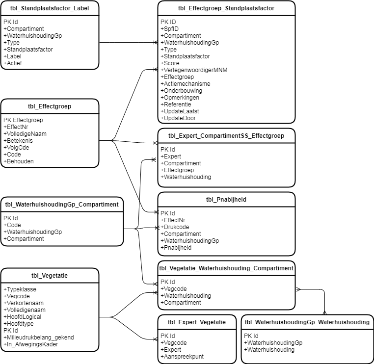

Onderstaande tabel geeft voor elke entiteit van de databank een lijst van de velden en hun belangrijkste kenmerken (o.a. type gegevens, lengte, al dan niet verplichte karakter, eventuele validatieregel, beschrijving).

```{r db_structuur, message=FALSE, echo=FALSE, warning=FALSE, results='asis'}
systs_fields <- read_csv2("../../../data/040_systschema_fields.txt") %>% 
  filter(!str_detect(SourceTable, "^MSys")) %>% 
  mutate(Type = case_when(
  Type == 1 ~ "dbBoolean",
  Type == 3 ~ "dbInteger",
  Type == 4 ~ "dbLong",
  Type == 8 ~ "dbDate",
  Type == 10 ~ "dbText",
  Type == 12 ~ "dbMemo",
  TRUE ~ as.character(Type)),
  Attributes = case_when(
  Attributes == 1 ~ "dbFixedField",
  Attributes == 2 ~ "dbVariableField",
  Attributes == 17 ~ "dbAutoIncrField+dbFixedField",
  Attributes == 18 ~ "dbAutoIncrField+dbVariableField",
  TRUE ~ as.character(Attributes))) %>% 
  select(-SourceField, -CollatingOrder, -DataUpdatable, -OrdinalPosition,
         -ColumnHidden, -ColumnOrder, -ColumnWidth, -DecimalPlaces) %>% 
  rename("FieldName" = "Name", "TableName" = "SourceTable") %>% 
   select(TableName, everything())

knitr::kable(systs_fields)

```

# Referenties {-}
