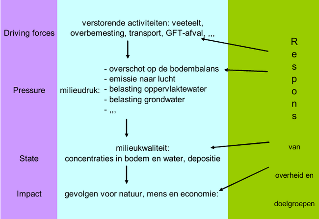

## Concepten

Hieronder worden de belangrijkste concepten toegelicht. Voor meer context verwijzen we naar het [uitgebreidere document](files/030_concepten/concepten_details.pdf).

Voor een verklarende woordenlijst verwijzen we naar het [lexicon](#lexicon).

### Standplaats

Een eerste centraal begrip is de standplaats. De **standplaats** van een vegetatietype is een ruimtelijke eenheid die homogeen is in de voor planten belangrijkste milieufactoren. Het gaat dus over een *lokaal schaalniveau*, dat bijvoorbeeld overeenkomt met het schaalniveau van een 'homogene habitatvlek', en desgevallend door een kleiner proefvlak (voor gegevensinzameling) wordt vertegenwoordigd.

De standplaats kan ingedeeld worden in compartimenten. Elk **milieucompartiment** is een ruimtelijke eenheid in de standplaats die een apart deel van het standplaatsmilieu vertegenwoordigt. We onderscheiden volgende milieucompartimenten: atmosfeer, bodem, grondwater, inundatiewater, oppervlaktewater en waterbodem. Binnen elk compartiment kunnen nog subcompartimenten onderscheiden worden volgens fasen. Bijvoorbeeld binnen het compartiment bodem zijn dit de gasfase (bodemlucht), de vloeibare fase (bodemoplossing) en de vaste fase (bodempartikels).

Milieufactoren op de schaal van een standplaats noemen we **standplaatsfactoren**. Een voorbeeld hiervan is het waterpeil. Zowel in het compartiment grondwater, inundatiewater als oppervlaktewater kunnen waterpeilen gemeten worden. We weten hiermee nog niet welk waterpeil bedoeld wordt en hoe dit gemeten wordt. Om dit te specifiëren werken we met milieuvariabelen. Een **milieuvariabele** is een variabele waarvoor eenduidig vastligt hoe ze gemeten, berekend en geanalyseerd wordt, en met welk tijdsinterval en subcompartiment ze overeenkomt.

Aan de hand van meerdere standplaatsfactoren en milieuvariabelen wordt de standplaats van een habittattype of regionaal belangrijk biotoop gekarakteriseerd. De noodzakelijke voorwaarden ten aanzien van bepaalde standplaatsfactoren opdat op een standplaats een bepaald vegetatietype kan voorkomen, worden ook de **standplaatscondities** of **standplaatsvereisten** van dat vegetatietype genoemd. Deze standplaatsfactoren zijn **sturend** voor het voorkomen van een vegetatietype.

### Milieuverstoringsketen

Wijzigingen aan milieufactoren kunnen van natuurlijke of antropogene oorsprong zijn. Is deze van antropogene oorsprong, dan spreken we van een **milieudruk**. Een milieudruk is vaak onmiddellijk gevolg van een maatschappelijk proces (zoals landbouw, verkeer, industrie, ...) en oefent een (vaak onrechtstreekse) negatieve invloed uit op natuur. Voorbeelden zijn verzuring via de lucht, eutrofiëring via het grondwater, toename overstromingsduur of -frequentie, ... 

{ width=70% }

De **milieuverstoringsketen** (figuur \@ref(fig:DPSIR)) brengt de volledige procesketen in beeld van een milieudruk. Ze wordt traditioneel opgedeeld volgens het DPSI(R)-model en wordt daarom ook wel de **DPSIR-keten** genoemd. Toegepast voor standplaatsen is dit:

- **D**riving force: een maatschappelijk proces (landbouw, verkeer, industrie, ...).
- **P**ressure: een milieudruk (eutrofiëring via de lucht, verontreiniging via het oppervlaktewater, ...).
- **S**tate: de milieukwaliteit (en de verandering daarin), dus ter hoogte van de standplaats en te beschrijven met standplaatsfactoren.
- **I**mpact: de toestand van de levensgemeenschap ter hoogte van de standplaats.

Daarenboven staat de **R**espons voor hoe de maatschappij omgaat met de problemen die de milieuverstoring (D, P, S en I) teweegbrengt.

In de context van een milieudruk onderscheiden we twee bijzondere types van standplaatsfactoren:

- **_P-proxies_**: standplaatsfactoren die in de procesketen kort na de milieudruk optreden;
- **_I-proxies_**: standplaatsfactoren die door de milieudruk (vroeg of laat in de procesketen) worden beïnvloed én die de vegetatie op directe wijze, d.w.z. fysiologisch beïnvloeden.

