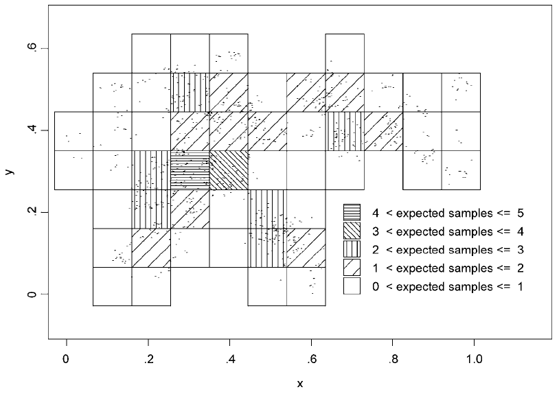

--- 
title: "Steekproef-strategie meetnetten natuurlijk milieu"
# author: "Floris Vanderhaeghe"
site: bookdown::bookdown_site
output:
  bookdown::html_document2:
    keep_md: TRUE
    number_sections: yes
    fig_caption: yes
    toc: TRUE
    toc_float:
      collapsed: FALSE
      smooth_scroll: FALSE
    includes:
        in_header: header.html
  bookdown::pdf_book:
    base_format: INBOmd::inbo_slides
    # subtitle: "Hier komt de optionele ondertitel"
    # location: "Hier komt optioneel de plaats"
    # institute: "Hier komt optioneel de affiliatie"
    keep_md: TRUE
    toc: TRUE
    slide_level: 2
    citation_package: none
---

```{r setup, include = FALSE, echo = FALSE}
library(knitr)
opts_chunk$set(
  echo = FALSE
)
library(tidyverse)
theme_update(text = element_text(size = 6))
```

# Principes

## Vooraf

- Monitoring van een milieuvariabele: op basis van:
    - ofwel oppervlaktedekkende modellen (i.f.v. tijd)
    - ofwel oppervlaktedekkende metingen (herhaald of continu in tijd)
    - ofwel met een steekproef = wat volgt


## Principes {.allowframebreaks}

- Elk hoofdmeetnet volgt een *aselecte* steekproefstrategie
- Elk hoofdmeetnet volgt een *eenvoudige* steekproefopzet in ruimte en tijd ~ begrijpbaarheid, verwerkbaarheid, duurzaamheid
- Kostenefficiëntie
- Haalbaarheid


\framebreak

- Elk hoofdmeetnet hanteert een *flexibele* steekproefopzet.
    - Criterium: inferentiewijzen eenvoudig, niettegenstaande evolutie van de context
    - Kenmerken:
        - aanpasbaarheid van vragen
        - bestand tegen aanpassing van domeinen en van steekproefkader
        - flexibiliteit inzake aanpasbaarheid van steekproefgrootte
        
        
\framebreak

- Afdoende ruimtelijke en temporele *dekking*
- Ruimtelijke *koppelingen*:
    - Meetnetten onderling maximaal gekoppeld (over milieucompartimenten heen)
    - Maximaal gekoppeld met meetnet biotische habitatkwaliteit


# Doelpopulatie en doelparameters

## Toestand {.allowframebreaks}

- Spatiale doelpopulatie: alle Vlaamse locaties van habitats/RBB's
- Temporele doelpopulatie:
    - periode van 6 jaar (natuurbeleidscyclus)
        - indien *nodig* korter of langer (veelvoud van 6 jaar)
    - welke deelperioden (cf. seizoenen) vertegenwoordigen we?
        - wat willen we?
        - afhankelijk van milieuvariabele
        

```{r}
set.seed(123456)
toestand <- 
    expand.grid(
        Maand = 1:72,
        Locatie = 1:200
    ) %>% 
    as.tibble()
toestand %>% 
    bind_cols(
        Bemonster = runif(200*72) > 0.98
    ) %>% 
    filter((Maand %% 12) %in% 4:7,
           Bemonster) %>% 
    ggplot(aes(x = Maand, y = Locatie)) + 
    geom_tile(data = toestand, fill = "lightgreen") +
    geom_tile(data = toestand %>% filter((Maand %% 12) %in% 4:7),
                                        fill = "violet",
                                         alpha = 0.5) +
        geom_point(size = 0.5) +
    scale_x_continuous(breaks = c(1,13,25,37,49,61)) +
    labs(title = "Toestandsmonitoring 6 jaar") +
    theme(panel.background = element_blank())
```

- Milieuvariabele (waarde **per sampling unit**): evt. eerst geaggregeerd op jaarniveau o.b.v. meerdere herhalingen in jaar (gemiddeld, gemiddeld hoogste, kwantiel, totale depositie, ...)
    - ofwel wegens continumetingen
    - ofwel door herhaalde metingen: dan bij voorkeur *gemodelleerd* (betrouwbaarheidsinterval!)
    - bv. LG3
    
\framebreak

- Doelpopulatie en steekproef: een spatiotemporele distributie van de milieuvariabele

\framebreak

- Doelparameter van de milieuvariabele: welk kenmerk  van de spatiotemporele distributie?
    - in principe: kan vanalles zijn: gemiddelde, kwantielen, range, ...
    - opdracht: wat is meest informatief voor beleid? (cf. brongericht, cf. kan Vlaamse indicator worden)
    - keuze doelparameter om ontwerp op te baseren: gestuurd door:
        - behoefte
        - precisie
        - kost
    
\framebreak

- Doelparameter:
    - 'default' focus voor ontwerp: het gemiddelde
    - ter discussie: 25 of 75 percentiel -- indien toetsing aan (lokale) grenswaarde mogelijk is


## Trend {.allowframebreaks}

- Spatiale doelpopulatie: alle Vlaamse locaties van habitats/RBB's
- Temporeel: interesse in de meerjarentrend:
    - verandering in tijd van de milieuvariabele wordt beschreven met een model
    - over een beschouwde periode van $x$ keer 6 jaar ($x$ > 1)
    - bv. lineair: trend = (gemodelleerde) vaste toe- of afname per jaar
    - welke momenten binnen een jaar vertegenwoordigen we met een trendmodel?
        - waarover willen we uitspraak?
        - afhankelijk van milieuvariabele

```{r}
toestand <- 
    expand.grid(
        Maand = 1:144,
        Locatie = 1:200
    ) %>% 
    as.tibble()
steekproefdata <- 
    toestand %>% 
    arrange(Maand %/% 72, Maand, Locatie) %>% 
    bind_cols(
        Bemonster = rep(runif(200*72) > 0.99, 2),
        Ruis = runif(200*144)*20
    ) %>% 
    mutate(Milieuvariabele = 50 + 0.05 * Maand + Ruis) %>% 
    filter((Maand %% 12) %in% 4:7,
           Bemonster)
steekproefdata %>% 
    ggplot(aes(x = Maand, y = Locatie)) + 
    geom_tile(data = toestand, fill = "lightgreen") +
    geom_tile(data = toestand %>% filter((Maand %% 12) %in% 4:7),
                                        fill = "violet",
                                         alpha = 0.5) +
    geom_point(aes(colour = Milieuvariabele),
                   size = 0.5) +
    scale_x_continuous(breaks = seq(1,133, 12)) +
    scale_colour_gradient(low = "blue", high = "darkred") +
    labs(title = "Trendmonitoring 12 jaar, jaarlijks meten, serieel alternerend [1-5]") +
    theme(panel.background = element_blank())

```

```{r eval=FALSE}
steekproefdata %>% 
    ggplot(aes(x = Maand, y = Milieuvariabele)) +
    geom_point(size = 0.5) +
    geom_smooth(method = "lm")
    scale_x_continuous(breaks = seq(1,133, 12)) +
```

```{r}
ggplot() +
    geom_tile(aes(x = Maand, y = Milieuvariabele), data = 
    expand.grid(Maand = c(1:144)[(1:144 %% 12) %in% 4:7],
                              Milieuvariabele = seq(from = min(steekproefdata$Milieuvariabele), 
                                                    to = max(steekproefdata$Milieuvariabele), by = 0.1)),
              fill = "grey", alpha = 0.5) +
    geom_point(data = steekproefdata, aes(x = Maand, y = Milieuvariabele), size = 0.5) +
    geom_smooth(data = steekproefdata, aes(x = Maand, y = Milieuvariabele), method = "lm") +
    scale_x_continuous(breaks = seq(1,133, 12)) +
    labs(title = "Trendmonitoring 12 jaar, jaarlijks meten, serieel alternerend [1-5]")
```

- Doelparameter trend: de *spatiaal gemiddelde* trend (meerjarentrend).
    - trend op een locatie = de verwachte trend volgens trendmodel voor die locatie (de verwachte waarde of 'gemiddelde' trend voor die locatie volgens model)


# Steekproef-strategie

## Types en typegroepen {.allowframebreaks}

- Sturing van precisie van ontwerp: op niveau van typegroepen
- Maar ook informatie wenselijk over de resp. types
    - Instandhoudingsbeleid: gunstige GSVI bereiken voor elk type
- Flexibiliteit wenselijk in typegroepen:
    - samenstelling kan evolueren (inzichten, noden)
    - onderlinge weging van types
        - bv. gelijk, volgens beleidsbelang, volgens oppervlakte


    
```{r}
SEdata <- 
    expand.grid(
    SE_typeparameter = c(10,50),
    Aantal_types = 1:30
) %>% 
    mutate(SE_typegroepparameter = 
               sqrt(1 / Aantal_types^2 * SE_typeparameter^2 * Aantal_types))
SEdata %>% 
    ggplot(aes(x = SE_typeparameter,
               y = SE_typegroepparameter,
               colour = Aantal_types,
               group = Aantal_types)) +
        geom_line() + 
        scale_colour_gradient(low = "blue", high = "darkred") +
        labs(title = "Assumptie: schatting is met dezelfde precisie voor elk type",
             x = "Standaardfout (SE) van parameterschatting per type",
             y = "SE parameterschatting per typeGROEP")
```


```{r}
SEdata %>% 
    mutate(Ratio_groepSE_typeSE =
               SE_typegroepparameter / SE_typeparameter) %>% 
    ggplot(aes(x = Aantal_types,
               y = Ratio_groepSE_typeSE)) +
    geom_line()
```

\begin{center}

Verband bij gelijke precisie van de typeschatters:


$$SE_{groep} = \frac{SE_{type}}  {\sqrt k}$$

met $k$ het aantal types

\end{center}

\framebreak

- Sturing van precisie van ontwerp: op niveau van typegroepen
- Maar ook informatie wenselijk over de resp. types
- Flexibiliteit wenselijk in typegroepen
 - Daarom stratificatie over *types*, met steekproefgrootte per type zodanig:
    - dat precisie van de types gelijkaardig is
    - dat precisie van de *typegroep* naar wens is (informatief, haalbaar, kostenefficiënt)
 - Typegewichten in de schatter voor de typegroep:
    - post-hoc (zonder invloed op design)
    - naar wens (types gelijk, ongelijk, volgens oppervlakte)
        - maar beter niet te veel aanpassen in de tijd: verwarrend signaal
    - in ontwerp: gelijke weging nemen


## Subpopulaties voor uitspraken

Niveaus hoger dan type: oppervlaktegewogen of anders gewogen.

- Alles samen (doelpopulatie: op maat per drukmeetnet)
- Typegroepen (categorisering op maat per drukmeetnet)
- SBZ-H-netwerk
- Type
- Andere mogelijke groeperingen van types, bv. een typeklasse
- ...

Subpopulatieschattingen via poststratificatie


## Spatiotemporele design: algemeen {.allowframebreaks}

- Design van steekproef: spatiaal of spatiotemporeel?
    - indien continumetingen of een jaarlijkse waarde voor alle locaties beschikbaar is: enkel spatiale design
    - anders: spatiotemporele design
 
\framebreak
   
- Verdroging via grondwater
- Eutrofiëring via grondwater
- Eutrofiëring via oppervlaktewater
- Eutrofiëring via overstromingswater
- Eutrofiëring via bodem
- Eutrofiëring via atmosfeer
- Verzuring via atmosfeer


    
## Spatiale design

- Ruimtelijk gebalanceerd op basis van GRTS-grid meetnet biotische habitatkwaliteit
    - Maximaliseren van ruimtelijke koppeling en daardoor verklarend vermogen
    - Maximaliseren van onderlinge ruimtelijke koppelingen
- Discussie in verband met grootte van steekproefeenheid
    - basis: 32 x 32 m² voor terrestrisch en semi-terrestrisch
    - aquatisch: segmenten van waterlopen; individuele plassen
    
## *Spatiale design - overgangsfase peilbuizen* {.allowframebreaks}

- Overgangsfase: gebruik van bestaande meetpunten totdat langere reeksen van aselecte set is opgebouwd.
    - aselecte set: kan ook bestaande peilbuizen bevatten die gekoppeld konden worden
    - bij inferentie: voorbehoud aantekenen!
- Enkel 'kwaliteitsvolle' peilbuizen komen in aanmerking
    - kwaliteitslabel nodig i.f.v. lengte van de meetreeks, volledigheid, wordt nog opgevolgd, enz.
- Selectie + aanvulling 'hiaten':
    - zodat op grovere geografische resolutie ruimtelijk wordt gebalanceerd
    - hiaten opvullen met punten uit de verkozen steekproef
    - daarbij *per type* werken met een grover grid en de 'verwachte' steekproefgrootte hanteren
    

{ width=10cm }
    

    
## Temporele design
    
- Elk jaar data verzamelen
- Spreiding van inspanning over jaren gelijkmatig
- Rekening houdend met temporele doelpopulatie
- Herhaling binnen jaar indien nodig (effect op precisie)


## Spatiotemporele of revisit design {.allowframebreaks}

Over jaren heen:

- Heel wat mogelijkheden in verdeling van de spatiale steekproef over de tijd (uiteenlopende herhalingspatronen)
- Niet van toepassing voor louter spatiale designs (jaarlijkse data van elke locatie)
- Terugkeerperiode?
    - overweging: samensporen meetnet biotische habitatkwaliteit? (kostenefficiënter?)
    - ook op maat van milieuvariabele:
        - ingeschatte snelheid van verandering
        - duurtijd en effect van verstoring
- Streven naar ruimtelijke balans per jaar (zodat ook temporele subpopulaties zinvol zijn)
    
    
\framebreak

- Indien veel locaties te bezoeken in een jaar: locaties evt. groeperen volgens ruimtelijk gebalanceerde clusters (hokken)
    
\framebreak

- Bv. een split panel:
    - kleiner deel van de locaties jaarlijks bemonsteren om daar het verband te onderzoeken tussen volledige tijdsreeksen (elk jaar gemeten) en onvolledige tijdsreeksen (sommige jaren gemeten). Dit verband is toe te passen als correctie van trendschatting voor de overige locaties
    - groter deel niet-jaarlijks bemonsteren, bv. volgens serially alternating pattern [1-5]: 6 panels, cyclus van 6 jaar per panel

\framebreak

Observaties binnen een jaar:

- pure panel [1, 0]: alles $x$ keer bemeten, systematisch gespreid over de beoogde periode (jaar, seizoen, ...)
- independent panels [1, n]: alles 1 keer bemeten, gespreid over de beoogde periode (jaar, seizoen, ...)
- tussenvormen (minder herhalingen dan pure panel)


