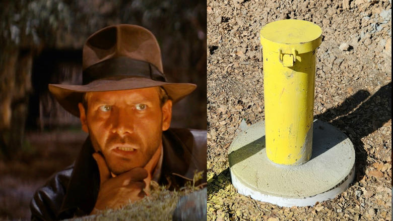

*I attempt to extensively list and document all design choices here, feel free to skip ahead to the results ([@sec-results]).*


```{r libraries}
#| code-fold: true
#| eval: true
void <- suppressPackageStartupMessages
library("dplyr")     |> void() # our favorite data wrangling toolbox
library("arrow")     |> void() # writing parquet files
library("ggplot2")   |> void() # a visualization toolbox

# to quick-load the meta data
source("./auxiliary_data_queries.R")

# uniform regression tools and plot helpers
source("./regression_tools.R")
```

:::{.callout-note}
Data is loaded from the previous files dynamically to auto-update figures and tables.
Please ensure that the data is up to date.
:::

```{r data-paths}
#| code-fold: true
#| eval: true

soilclasses <- c("heavy", "light", "peat")

combine_path <- function(filepath) here::here("cache", "regression", filepath)
stitch_filepath <- function(label, sc, reg_var, extension = "parquet") {
  # examples: 
  #   label = "allin", "slopefilter", "maaiveld"
  #   sc = "heavy", "light", "peat"
  #   reg_var = "dw", "dm"
  #
  return(paste0(
    sprintf("%s_%s_%s", label, reg_var, sc), 
    ".", extension, 
    collapse = ""
    ))
}

load_plotdata <- function(
    label = c("slopefilter", "allin", "maaiveld"),
    soilclass = c("heavy", "light", "peat"),
    regression_variable = c("dw", "dm")
  ) {
  data_file <- combine_path(
    stitch_filepath(label, soilclass, regression_variable,
    extension = "parquet")
  )

  return(arrow::read_parquet(data_file))
}

load_fitdata <- function(
    label = c("slopefilter", "allin", "maaiveld"),
    soilclass = c("heavy", "light", "peat"),
    regression_variable = c("dw", "dm")
  ) {
  data_file <- combine_path(
    stitch_filepath(label, soilclass, regression_variable,
    extension = "rds")
  )
  return(readRDS(data_file))
}

```


```{r aesthetics-and-style}

soilclass_colors <- c(
  "heavy" = "sienna",
  "light" = "burlywood",
  "peat" = "darkseagreen",
  "unknown" = "slategray"
)
```


# Quest

You might know the feeling:
coming to a field site, raincovered but still wet, well equipped and ready to drill a hole in the ground and place a new PVC tube as observation well for the MNE project.
Yet this time, something is different.
You have the feeling that someone has been there before.




The question to be tackled in this summary is:

**Under what circumstances can we re-use an existing installation for MNE?**


More specifically, we strive to define a ruleset, based on prior data, which guides this critical field decision[^1].

[^1]: Re-use might require re-freshment, which we expect to be the favorable option compared to *de-novo* installation in a vast majority of cases.


# Expert Knowledge

Categories and parameters to consider:

- **spatial distance**
- type and status of the existing installation
- topographic continuity
  - no obvious discontinuities, e.g. in soil type
  - e.g. distance from surface water bodies
  - elevation and slope (see below): max. $0.01 m$ difference per meter distance
- common sense framing:
  - if there is an existing site half a meter from target, obviously use it
  - if there is a site three kilometers further, that is obviously not close enough 
  - GRTS raster constraint: address cells are $32 m$ resolution, and there are advantages to stay within that range (@florisvdh are there?)
- bias avoidance:
  - our spatial sample is intentionally random
  - existing sites might introduce implicit, unmeasurable bias to the monitoring
  - example: if observation wells were always placed next to existing trails (micro-habitat bias)
  - the only solution to implicit bias is *fully random placement*
- cost savings from re-using an installation
- external constraints: site accessibility and land owner's interests


Assembling evidence for a reasonable criterium regarding spatial distance is the main focus of the present summary.


# Variograms *Sensu Lato*

Which leads us to the subordinate, but nevertheless crucial question: 
how to measure the spatial coupling of two hypothetic locations in Flanders?
By coupling, we mean *non-independence*: measurement of one site could reliably inform about the other site.


Firstly, coupling is not equal coupling. 
Our initial monitoring goal is eutrophication through groundwater, for which we measure groundwater chemistry.
Unfortunately, we lack a densely sampled data set with sufficient simultaneous data points to quantify coupling of groundwater *chemistry*.
(There is a rich data set, yet the nature of lab analysis of ground water prohibits high temporal sampling frequency, and the temporal dimension introduces confounding effects.)
Therefore, it is necessary to turn to proxies.
At a later project phase, we will also investigate ground water levels (to measure groundwater-associated wetting or drying).
Groundwater levels are acquired from continuous data loggers, and so we have access to a broad, densely sampled, existing data set.


To estimate whether two point measurements in more or less adjacent locations are coupled, people have used variogram models.
**Variograms** *sensu stricto* quantify the semivariance[^2] of measurements as a function of distance between two measurement points.
When the distance is zero, one expects to see the base variance, i.e. uncertainty of the measurement.
With increasing distance, variance increases due to the global influence of all kinds of differences between observation points.
At some distance, however, variance will plateau due to the limited range of possible or plausible measurement values.

[^2]: You may expect semi-variance to be really just the variance, divided by two, but researchers have mathematically adjusted or simplified the formula in various ways over the years.


The rationale of plotting out semivariance against spatial distance is to visually display an expectance of the measurement differences between any two hypothetical locations.
However, the calculation of variance involves a square term, which turned out to be mathematically unvaforable in our application to water levels.
Instead, and related to our primary question, one can directly plot the *Mean Absolute Difference* of simultaneous measurements at two sites.
Taking all available data points (i.e. a variety of site-to-site spatial distances and measurement-to-measurement differences) 
provides a visualization of *difference* as a function of *distance*.
We call this non-conventional difference-distance plot variogram *sensu lato*, acknowledging that real variograms are only real with semivariance on the y-axis.


From theoretical considerations, such difference-distance plots are expected to take a sigmoidal (strictly increasing) shape, which can be modeled by
a **Matérn function**.
The concrete parameters which shape that function are identified by a regression procedure (*vulgo:* "fitting").
With the data-parametrized Matérn, one can calculate the theoretically expected difference at any distance.

:::{.callout-note}
The sole purpose of this whole procedure is to calculate the distance 
at which we would expect a difference in water levels of more than $0.01 m$, i.e. $1 cm$.
:::


This threshold of $1 cm$ is what we define a "just tolerable" difference.
To re-iterate: water level here partly serve as a proxy for other measures of interest, 
which is why a rather strict difference of $1 cm$ is justified.


# Data Set

There are numerous ecological, geographical, and administrational parameters which are relevant or not 
to the distance-dependent difference which we observe, quantify, and model.
Most of those site-specific and measurement-specific parameters are easily accessible via the WATINA database or public data sources.


Some example database entries:

```{r show-off-metadata}
meta_data <- join_auxiliary_cache(label = "metadata") %>%
  join_auxiliary_cache(label = "elevation", index_column = "pp_idx") %>%
  join_auxiliary_cache("waterdistance", index_column = "pp_idx") %>%
  join_auxiliary_cache("empiricalmodes", index_column = "pp_idx") 

knitr::kable(t(sample_n(meta_data, 5)), decimals = 2)
```


The parameters which turn out to have a relevant influence are **soilclass** and **slope**. 
We filtered site pairs to share the same soil classification in the rough categories of "heavy soil", "light soil", and "peat". 
The analyses below were applied separately for each soilclass.
The influence of slope is mechanistically obvious, because we use meters "TAW"[^3] as water level units.
This system references a coordinate origin at sea level, and as a consequence elevation is a direct component of water levels (think of a point close to the sea, *versus* one in the Flemish Ardennes).
The tolerable threshold for slope applied herein is $1 cm$ per meter distance, 
i.e. a pair of sites $10 m$ apart will be excluded if they differ more than $0.1 m$ in elevation.

[^3]: "Tweede Algemene Waterpassing", *cf.* <https://nl.wikipedia.org/wiki/Tweede_Algemene_Waterpassing>


One parameter which turned out to have no relevant influence is data validation status in WATINA:
Though we re-ran the analysis procedure on only validated data, non-validated data had a confirmative effect on the outcome and increased model robustness.
Conversely, including unvalidated measurements doubles sample size (!), which is crucial for the rather fine data segments and the high sample size demand of variogram binning, and for the high accuracy we would like to achieve.
A possible explanation (as in: speculation by the author) is that the main reason for non-validation is not data quality, but lack of workforce for the validation procedure (which we did not evaluate or judge; we took a purely data-driven perspective).

Parameters which we considered, but which showed no relevant[^4] influence on the outcome, are distance to surface water, filter depth (a physical installation characteristic), 
or oscillatory characteristics of the water levels themselves.

[^4]: "Non-relevance" might also be indicated by data set stratification and consequently too low subset sample sizes.


On the background of these considerations, we queried all available data from WATINA, clustered and paired sites, and calculated the differences.
Repeated observations were averaged per site pair, which prevents sampling imbalance and pseudo-replication, but also bluntly removes the temporal aspect from the data.
A relevant step in variogram computation is the binning of distances, which of course does have consequences for the outcome.
Binning implies that a number of different (completely unrelated) site pairs which are (by chance) a similar distance apart will be grouped and averaged. 
Too wide bins will deter the accuracy of the regression result by coarse abscissa sampling, whereas too narrow bins will cause the same effect (i.e. inaccuracy) by inter-bin noise.
For variograms, it is rather important to have well-filled bins (i.e. sufficient number of pairs per bin), whereas bin width is of minor importance due to the subsequent regression step.
We chose to compute bins of variable width, yet approximately similar (high) number of entries.

The uncertainty of regression parameters was determined by bootstrapping, following the procedure outlined [here](https://www.modernstatisticswithr.com/modchapter.html#bootstrap).
Details of all calculation and selection procedures can be found in the accompanying notebooks.


# Results {#sec-results}

## Distance Threshold

Given:

- a measurement of mean absolute difference in `mTAW` water levels
- averaging repeated measures per site pair
- grouping for soilclass, filtering for elevation difference per distance of $0.01 m / m$
- variable-width binning to approximately 128 site pairs per bin

...we can compute the following variograms.

::: {.panel-tabset group="parameter"}
### mTAW

```{r load-regressions-dw}
data <- list(
  "heavy" = load_fitdata("slopefilter", "heavy", "dw"),
  "light" = load_fitdata("slopefilter", "light", "dw"),
  "peat" = load_fitdata("slopefilter", "peat", "dw")
)


```


```{r plot-regressions-dw}
#| label: fig-regression-dw
#| fig-cap: "Matérn regression of water level difference $\\langle dw\\rangle$ (mTAW) on different soil classes (brown: heavy; yellow: light; green: peat)."

g <- ggplot(NULL)
for (sc in names(data)) {
  regression_result <- data[[sc]]
  g <- add_regression_to_plot(g, regression_result, color = soilclass_colors[sc])
}
g + xlab("distance (m)") + ylab("mean absolute difference (mTAW)") +
  ylim(0, 1.6) +
  theme_minimal()

```

From the Matérn regression models visualized in the diagrams, we can derive the follwing **distance thresholds for measurement site re-use** (criterion: $1 cm$ difference).


```{r results-table-dw}
knitr::kable(
    t(sapply(names(data),
      FUN = function(sc) calculate_limit(data[[sc]])
    )),
    digits = 1
  )
```


### mMaaiveld


```{r load-regressions-dm}
data_m <- list(
  "heavy" = load_fitdata("maaiveld", "heavy", "dm"),
  "light" = load_fitdata("maaiveld", "light", "dm"),
  "peat" = load_fitdata("maaiveld", "peat", "dm")
)


```


```{r plot-regressions-dm}
#| label: fig-regression-dm
#| fig-cap: "Matérn regression of water level difference $\\langle dw\\rangle$ (mMaaiveld) on different soil classes (brown: heavy; yellow: light; green: peat)."

g <- ggplot(NULL)
for (sc in names(data_m)) {
  regression_result <- data_m[[sc]]
  g <- add_regression_to_plot(g, regression_result, color = soilclass_colors[sc])
}
g + xlab("distance (m)") + ylab("mean absolute difference (mMaaiveld)") +
  ylim(0, 1.6) +
  theme_minimal()

```


From the Matérn regression models visualized in the diagrams, we can derive the follwing **distance thresholds for measurement site re-use** (criterion: $1 cm$ difference).


```{r results-table-dm}
knitr::kable(
    t(sapply(names(data_m),
      FUN = function(sc) calculate_limit(data_m[[sc]])
    )),
    digits = 1
  )
```


:::


Via bootstrapping, the uncertainty of that threshold can be quantified.


::: {.panel-tabset group="parameter"}
### mTAW

```{r reload-bootstrap}
bootstrap_data <- arrow::read_parquet("./data/bootstrapping_dw_soilclass.parquet")
ref_boots <- bootstrap_data %>%
  filter(i == 0)
sub_boots <- bootstrap_data %>%
  filter(conv == 0, i > 0, if_all(everything(), ~ !is.na(.x)))


```

```{r plot-bootstrap}
sub_boots %>%
    ggplot(aes(x = threshold, fill = soilclass)) +
    geom_histogram(bins = 256, width = 1.05, color = NA, alpha = 0.67, position = "identity") +
    geom_vline(xintercept = ref_boots$threshold) +
    xlab("threshold to 1cm difference") +
    scale_fill_manual(values = soilclass_colors) +
    scale_color_manual(values = soilclass_colors) +
    xlim(0, 32) +
    theme_bw()
```

```{r table-bootstrap}
threshold_quantiles <- sub_boots %>%
  summarize(
    q02 = quantile(threshold, c(0.02)),
    median = quantile(threshold, c(0.50)),
    q98 = quantile(threshold, c(0.98)),
    .by = soilclass 
  ) 
knitr::kable(threshold_quantiles, digits = 1)
```

### mMaaiveld

```{r reload-bootstrap}
bootstrap_data <- arrow::read_parquet("./data/bootstrapping_dm_soilclass.parquet")
ref_boots <- bootstrap_data %>%
  filter(i == 0)
sub_boots <- bootstrap_data %>%
  filter(conv == 0, i > 0, if_all(everything(), ~ !is.na(.x)))


```

```{r plot-bootstrap}
sub_boots %>%
    ggplot(aes(x = threshold, fill = soilclass)) +
    geom_histogram(bins = 256, width = 1.05, color = NA, alpha = 0.67, position = "identity") +
    geom_vline(xintercept = ref_boots$threshold) +
    xlab("threshold to 1cm difference") +
    scale_fill_manual(values = soilclass_colors) +
    scale_color_manual(values = soilclass_colors) +
    xlim(0, 32) +
    theme_bw()
```

```{r table-bootstrap}
threshold_quantiles <- sub_boots %>%
  summarize(
    q02 = quantile(threshold, c(0.02)),
    median = quantile(threshold, c(0.50)),
    q98 = quantile(threshold, c(0.98)),
    .by = soilclass 
  ) 
knitr::kable(threshold_quantiles, digits = 1)
```

:::


:::{.callout-warning}
For practical simplicity, a re-use threshold of $10 m$ seems appropriate,
given that the measurement sites in question differ by less than $10 cm$ in elevation (via slope filter).
:::


This distance is conform with the common sense criterion (communication to land owners, cost saving).
Bootstrapping indicates an accuracy of less than $\pm 10 m$.
With this threshold, re-use would usually stay in the target GRTS raster cell.


Yet how many sites would be affected? 


## Application to Sampling Frame

To quantify what this threshold would mean for practical roll-out of the monitoring network, we can take a hypothetical ("work in progress") draw of sites from the sampling frame "Proof Of Concept".
The sample was provided by Floris Vanderhaeghe (&#64;florisvdh) on Feb. 3rd, 2025, and contains 978 potential site locations.

We calculate all cross-distances between (A) those hypothetical sites, and (B) all existing watina locations.
A histogram of these distances is one particular realization of the global probability distribution of site distances.
Taking the **cumulative cross-distance distribution**, again approximated by a regression and boot-strapped to determine uncertainty, provides a good estimate of re-use ratio as a function of distance threshold.

TODO figure


:::{.callout-warning}
Given the re-use threshold of $10 m$, we anticipate XXXXXX $\pm$ sites to be applicable re-use, or ZZZZ % of the planned MNE sites.
:::

(Note that this is only a rough estimate, neglecting slope threshold and other exclusion criteria which will effectively lower the actual re-use ratio.)


## Effect of Validation- and Slope Filter

Optionally turning on one or turning off the other critical filter will obviously affect the shape of the difference-distance curve.


## Ground Level 

Our evaluation of the slope effect receives (TODO: or not??) further support from the use of relative ground level for water level comparison.
Instead of `mTAW`, we can query the relative level `mMaaiveld` and repeat the whole procedure.

TODO


## Wet and Dry Season

TODO slope filter applied?


# Minor Considerations

- bias in existing data -> no options
- scales: multi-modal variograms
